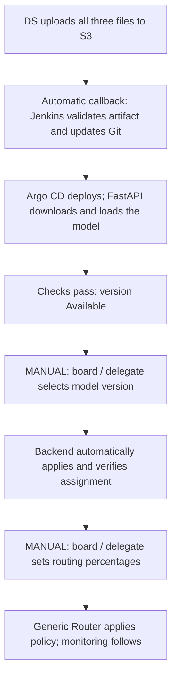

# NCM MLOps: DS upload to serving

Start with **DS uploading the model to S3**. Training is outside scope. Keep FastAPI's current download/retry logic; defer `initContainer`.

```text
s3://fcp-model-artifacts/serving/new_customers/2.5.0/
  model.cbm
  model_meta.json
  golden_sample.json
```



| Component | Status | What remains |
|---|---|---|
| DS model upload to S3 | **Done** | Completed-upload callback contract |
| Jenkins trigger and preparation job | **To verify** | Callback, validation, deduplication, and Git updates |
| Shared Helm / Argo CD candidate deployment | **To verify** | Chart wiring, separate candidate, readiness, and version checks |
| FastAPI S3 download and retries | **Done** | Confirm bucket/prefix mapping for this artifact |
| Model-version assignment UI | **Not implemented** | Build manual selection and automated assignment backend |
| Generic Router routing-configuration UI | **Done** | Verify policy application/readback and audit coverage |
| Monitoring, rollback execution, and cleanup | **To verify** | Confirm existing capabilities and implement missing integration |

**Done** reflects confirmed existing behavior. **To verify** means implementation status is unknown, not necessarily missing.

The publishing script calls Jenkins only after all three uploads succeed. Jenkins prepares an eligible version; humans select its role and traffic share. The Kubernetes excerpt names a different bucket, so verify the actual FastAPI configuration before deployment.

The [implementation plan](ncm-implementation-plan.md) contains the full 14-step status table. Its stage-based target is **85.7% automated / 14.3% manual**; this is not a current completion percentage. The summary table above groups those steps.
