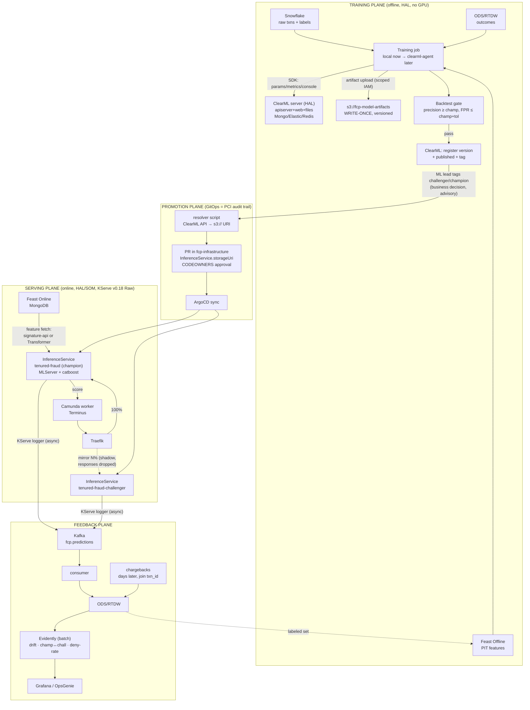

# FCP MLOps Platform — End-to-End Architecture

| | |
|---|---|
| **Status** | Living document — Phase 0 in progress (ClearML deployed 2026-07-07) |
| **Date** | 2026-07-02, updated 2026-07-07 |
| **Owner** | Georgiy Marinov (Infrastructure) |
| **Scope** | Training → Registry → Promotion → Serving → Feedback for all FCP ML models |
| **Supersedes** | Salome's "MLOps Roadmap V3" (ClearML + FastAPI), "mlops ph0" diagrams, "Experiments & Findings" doc |

---

## 1. TL;DR

We are building the FCP ML platform on four decoupled planes:

1. **Training** — DS train locally (later: `clearml-agent` on HAL/SOM hardware), log experiments and register models in **ClearML** (self-hosted OSS — **deployed on HAL prod**, see §5), artifacts land in a **write-once S3 bucket**.
2. **Promotion** — business decision is a ClearML tag; the **enforcement point is a Git PR** in `fcp-infrastructure` (GitOps = PCI audit trail). ArgoCD syncs it to the cluster.
3. **Serving** — **KServe v0.18 RawDeployment** (already deployed on HAL as ArgoCD apps) with MLServer runtimes. Champion/challenger via **Traefik traffic mechanics** first, thin router later if needed.
4. **Feedback** — predictions logged async to Kafka `fcp.predictions` → ODS/RTDW → joined with chargebacks → next training cycle. **Evidently** for drift and champion↔challenger comparison.

The registry (ClearML) is a **control plane only**: nothing in the inference path ever calls it. KServe pulls model artifacts directly from S3. If ClearML is down, scoring continues and new pods still start.

---

## 2. Decision log

| # | Decision | Rationale | Status |
|---|---|---|---|
| D1 | **KServe RawDeployment**, no Knative/Istio | Cilium has no mesh; latency targets (<100ms p95 pricing); lighter ops | ✅ Deployed (v0.18.0, HAL) |
| D2 | **KServe over plain FastAPI containers** | One V2 (Open Inference Protocol) contract for 5→30 models; storage-initializer (model release without image rebuild); built-in payload logging, probes, metrics | ✅ Locked |
| D3 | **ClearML over MLflow** (reverses earlier MLflow decision) | Built-in orchestration (agent queues + pipelines — we have zero orchestration today), ClearML Data dataset versioning, DS team buy-in. Cost accepted: 6 self-hosted components, loss of proxied-artifact mode | ✅ Locked 2026-07 — do not re-litigate |
| D4 | **`storageUri` = direct `s3://…`**, never registry URI, never ClearML fileserver over HTTP | Registry must not be a runtime dependency of pod startup; PCI resilience | ✅ Locked |
| D5 | **Promotion via PR in `fcp-infrastructure`** (GitOps) | PCI audit trail; compensates weak RBAC in ClearML OSS — tags are advisory, Git is enforcement | ✅ Locked |
| D6 | **Champion/Challenger ≠ canary** | `canaryTrafficPercent` is **silently ignored in RawDeployment** (kserve#5335); even in Serverless it is non-deterministic and transitional. C/C = two InferenceServices + traffic split at ingress/router level | ✅ Locked |
| D7 | **CatBoost via MLServer** (`mlserver-catboost`) custom/stock runtime | KServe has no native catboost format; `mlserver` runtime already enabled in our runtime-configs chart | 🟡 Pending latency PoC |
| D8 | **No Unleash in scoring path** | Feature flags conflate rollout with governance; allowed only as emergency kill-switch that can *reduce* challenger traffic to zero | ✅ Locked |
| D9 | **Single ClearML instance** (no prod/dev split), HAL + cold DR to SOM | Control plane, not in inference path; RTO of hours is acceptable; same class as ArgoCD/Jenkins. Logical env separation via ClearML projects | ✅ **Deployed 2026-07-07** (HAL prod `c-q4mdc`; backups pending) |
| D10 | Write-once **S3 artifact bucket** with narrow IAM | ClearML SDK writes S3 directly (no proxied mode like MLflow `--serve-artifacts`) — immutability + narrow IAM compensate | ✅ **Built 2026-07** (Object Lock GOVERNANCE + versioning; reader + writer IAM users) |
| D11 | **GHA builds the image, clearml-agent runs the job** (not either/or) | Training data is on-prem (ODS, Feast offline); a cloud GHA runner can't reach it and gives no lineage. GHA = CI/image; agent = execution substrate on HAL | ✅ Locked |

Rejected along the way: Seldon v2 (BSL license = PCI blocker), BentoML, ModelMesh (deprecated), Knative/Serverless (no mesh), MLflow (D3), Unleash routing (D8), per-model Helm+FastAPI (doesn't scale past ~6 models).

---

## 3. Target architecture



Compact plane view:

```
TRAINING   DS (local → agent) ──ClearML SDK──▶ ClearML [HAL]         (metadata)
                              └───────────────▶ s3://fcp-model-artifacts (artifact, write-once)
           package: model.cbm + thresholds.yaml + feature_schema.json + metrics.json

PROMOTION  ClearML published+tag ──resolver──▶ PR (storageUri=s3://…) ──▶ ArgoCD ──▶ KServe

SERVING    Camunda ──▶ Traefik ──┬──────────▶ IS champion   ──▶ score ──▶ Camunda
                                 └─mirror %──▶ IS challenger    (shadow, dropped)
           feature fetch: signature-api (korell) or KServe Transformer — open (task #5)

FEEDBACK   KServe logger ──▶ fcp.predictions ──▶ ODS/RTDW ◀── chargebacks
           Evidently: drift + champion↔challenger ──▶ Grafana/OpsGenie
```

**Key invariant:** every plane can fail without breaking the plane below it. ClearML down → scoring unaffected. Kafka down → scoring unaffected (async logger drops). Git/ArgoCD down → current models keep serving.

---

## 4. Training plane

### 4.1 Current state (ground truth, 2026-07)

- No orchestrator of any kind. DS train **locally** (a Python script on the DS laptop) and push artifacts to S3 by hand.
- The script pulls **Snowflake** (raw txns + labels) **+ ODS/RTDW** (outcomes), and will pull the **Feast offline** store (PIT features). Two of these three — ODS and Feast offline — are **on-prem PostgreSQL**; Snowflake is reachable over the network. → training must run **inside the HAL/SOM perimeter**.
- Training code home: **TBD, new repo landing ~2026-07-09** (name to be confirmed). `boss-caf-ml-models` is **deprecated / no longer used** (answer #1) — do not build on it.
- `boss-caf-fraud-model` is the **legacy FMS runtime** (SQS→score→SNS on ECS) — migration target, not the future training base.
- Note on a DS misconception: ClearML does **not** push the model artifact to git. It records the **git commit** as code-lineage (metadata) and uploads the artifact to `output_uri`. We set `output_uri=s3://fcp-model-artifacts/…` (D4/D10); git is read-only provenance, never artifact storage.

### 4.2 Design principle — GHA and ClearML are two layers, not a choice

The "GitHub Actions **or** ClearML" question is a false dichotomy. They sit at different levels and both are used:

| | GitHub Actions | clearml-agent |
|---|---|---|
| Role | CI: lint / unit-test / **build the training image** | Execution substrate for the **training job itself** |
| Trigger | git push / merge | enqueue (UI/CLI), schedule, pipeline, event |
| Lives | ephemeral runner | long-lived agent **on HAL/SOM** (inside the data perimeter) |
| Lineage | none | full: commit, params, metrics, artifacts, environment |

**Decision:** GHA builds the training **image** and tests the code; the multi-hour, stateful, on-prem-data-bound training job runs on a **clearml-agent on HAL** — never on a GHA runner. A cloud GHA runner can't reach ODS / Feast offline anyway. (Recorded as **D11** below.)

### 4.3 Phased training plan (T0 → T3)

Each phase delivers value on its own and does not block on the next.

**T0 — instrument, zero infra** *(now; unblocks everything)*
- DS adds to the script: `Task.init(project="fraud/tenured", …)`, log params/metrics, `OutputModel(output_uri="s3://fcp-model-artifacts/…")`. Same `Task.init` in the **backtest** script.
- Job still runs on the DS laptop; writes to S3 under the **DS SSO role** (answer #7 — already covered).
- Result: experiments, metrics, artifacts, code-lineage in ClearML **today**. Infra work: none. Owner: DS.

**T1 — remote execution on HAL** *(first infra work here)*
- Stand up **one `clearml-agent`** (helm `clearml-agent`, k8s pod-per-task) servicing queue `training`, as an ArgoCD app in `kubernetes-onprem/clearml/`.
- GHA gets its real job: build the **training image** (catboost/lightgbm/xgboost/torch baked) → ECR. Agent runs the job in that image (docker mode) → no re-resolving heavy deps each run.
- DS adds `task.execute_remotely(queue="training")` — same script, now on on-prem hardware, off the laptop, with in-cluster access to ODS/Feast.
- S3 writes now happen from a **pod**, not a human → uses `TrainingArtifactWriter` (see §4.5).

**T2 — pipeline + backtest as a gate**
- Wrap into a `PipelineController`: **train → backtest-gate (precision ≥ champion, FPR ≤ champion+tol) → register + published + tag=candidate**.
- Gate fail = pipeline fails, nothing registered. Backtest stops being a manual DS step and becomes the entry to the promotion plane (§6).

**T3 — scheduled / event-driven retrain**
- `TaskScheduler` (e.g. weekly) or `TriggerScheduler` (new labeled volume in Feast offline) enqueues the pipeline. Fully automatic loop — Roadmap Phase 2.

### 4.4 ClearML execution primitives (why ClearML can run these jobs at all)

1. `Task.init()` — passive SDK tracking; runs anywhere (T0).
2. `clearml-agent` + queue — daemon pulls a task, recreates env (docker + git-clone + pip), runs it **remotely**; `execute_remotely(queue=…)` = write-local / run-on-HAL (T1).
3. `PipelineController` — DAG of tasks, each step runs on a queue via an agent (T2).
4. `TaskScheduler` (cron) / `TriggerScheduler` (tag/dataset event) — enqueue the pipeline automatically (T3).

The **backtest** is just another Task in T0/T1 and a first-class **pipeline step** in T2 — this is exactly ClearML's purpose (D3: "we have zero orchestration").

### 4.5 Infra I own for the training plane

- **clearml-agent on K8s** — helm `clearml-agent` v5.3.3 (k8s-glue), controller pod watches queue `training` and spawns **one pod per Task** (no DinD). **Deployed 2026-07-09** (branch `mlops-pipeline`): vendored in `kubernetes-onprem/clearml-agent/` (charts/ + values-hal-prod.yml + manifests/externalsecrets.yaml + argoapp.yml — 2 ArgoCD apps, eso wave -5 + helm, same split as the server). Dedicated namespace **`clearml-agent`** (isolated from the `clearml` control plane), reaches the server over in-cluster DNS (`clearml-apiserver.clearml.svc:8008`, internal HTTP — sidesteps the LB/IPv6 nginx issues). Deploy prerequisites: (a) ClearML worker app-credentials → Vault `boss_mr/prod/fcp/clearml-agent` (`agentk8sglue_key`/`_secret`); (b) `TrainingArtifactWriter` keys → Vault `boss_mr/prod/fcp/models` (needed before first task, not before controller). Git creds ExternalSecret + env are wired-but-commented until the repo lands. **Battle fix:** the upstream `clearml-agent-k8s-base:1.24-21` image is Ubuntu 18.04/py3.6 (last push 2022) and self-updates clearml-agent from PyPI at boot — unpinned it pulls agent ≥3.0 (py3.7+ syntax) and crash-loops with `SyntaxError: future feature annotations`; 2.0.5–2.0.7 also break (bad regex inline flags in `custom_template.py`, despite the py3.6 classifier); fixed with `CLEARML_AGENT_UPDATE_VERSION="==2.0.4"` — newest release that actually imports on py3.6, verified in-cluster with a throwaway pod. Also: `createQueueIfNotExists` must stay **false** (the flag goes to the 2022 baked-in wrapper script that doesn't know it); queue `training` created once via `queues.create` API. The image's `bash -x` entrypoint prints the worker keys into pod logs — one more reason for the proper fix: own glue image on py3.11 → ECR.
  - ⚠️ **OSS limitation:** per-queue pod templates (`templateOverrides`, different resources per queue) are **Enterprise**. On OSS all queues share one base pod-template → if we need distinct resource profiles (light backtest vs heavy train), run a **separate copy of this chart per profile** with its own queue, not an override. One agent is enough to start (default profile: req 2CPU/8Gi, lim 6CPU/16Gi, no GPU).
- **`TrainingArtifactWriter` IAM identity** — mirror of the KServe reader, added to `terraform/modules/model-artifacts/iam.tf`. IAM user, keys manual → Vault (`boss_mr/prod/fcp/models`) → ESO → baked into the agent's base pod-template (`envFrom`). **Write-only:** `s3:PutObject` + `ListBucket`, no delete, no read. Immutability held by Object Lock + versioning.
- **Agent creds** — the controller pod needs its own ClearML worker credentials (Vault→ESO) and a git deploy-token for the training repo.
- **GHA training-image pipeline** — in the (pending) training repo.

### 4.6 Artifact bucket — BUILT (2026-07)

- `s3://fcp-model-artifacts`, account `195812867533` (**not** CDE `084356055521`). Terraform: `terraform/modules/model-artifacts/`.
- **Write-once** = Versioning ON + **Object Lock (GOVERNANCE, 365d)** — S3 has no deny-overwrite condition, so immutability is done the industry-standard way: every PUT is a new immutable version, none deletable in-window (PCI audit trail). SSE-S3, full public-access-block, TLS-only bucket policy.
- IAM (house on-prem pattern, keys → Vault, never tfstate): **`KServeModelReader`** (read, assume `kserve-model-artifacts-reader`) + **`TrainingArtifactWriter`** (write-only). OIDC federation parked (RKE issuers not STS-resolvable); role kept for future re-plumb.
- Rationale: ClearML SDK uploads to S3 directly (no MLflow-style proxied mode), so trust = narrow creds + immutability, not "no creds".

---

## 5. Registry & ClearML — DEPLOYED (2026-07-07)

### 5.1 Deployed state

Running on **HAL prod** (`prod-rancher-hal` / `c-q4mdc`), namespace `clearml`. Everything lives in `kubernetes-onprem/clearml/`:

- **Chart:** official [`clearml/clearml-helm-charts`](https://github.com/clearml/clearml-helm-charts) **v7.15.0** (app 2.0.0), vendored unpacked in `charts/` (kserve pattern). Values: `values-hal-prod.yml`.
- **ArgoCD:** three Applications in project `mt` (deliberately split — shared ArgoCD is 2.8.6 where multi-source is beta with UI rollback disabled):
  - `clearml-eso` (wave -5) → `manifests/externalsecrets.yaml` only (`directory.include`)
  - `clearml` (wave 0) → helm chart
  - `clearml-dns` (wave 0) → `manifests/dnsendpoints.yaml` only
- **Components:** apiserver ×2 (ClusterIP), webserver, fileserver (20Gi — artifacts go to S3, not here), MongoDB (bundled bitnami, standalone — **interim**, migration paths documented in values), Elasticsearch ×1, **Dragonfly** ×2 (chart 7.x replaced Redis). All PVCs on `vsphere-csi-sc`.
- **Ingress:** `nginx-mt`, no TLS block (LB-terminated, prod pattern): `clearml-app-hal`, `clearml-api-hal`, `clearml-files-hal` `.mr.bossrevolution.com`. DNS via `DNSEndpoint` CRs (CNAME → `lb-int-hal`).
- **Auth:** fixed-users mode; Vault `boss_mr/prod/fcp/clearml` (8 properties) → ESO → `clearml-server-auth` + `clearml-fixed-users`. Gotcha discovered: chart's `existingSecret` also requires `fileserver_key`/`fileserver_secret` — upstream docs omit them; missing keys = pods stuck.
- **Ops fixes learned during rollout:** `DISABLE_NGINX_IPV6=true` on webserver (HAL nodes have IPv6 disabled — nginx dies on `[::]:80` without it); Dragonfly VCT needs explicit `storageClassName`.
- **Adding a user:** edit `fixed_users_conf` in Vault → `kubectl -n clearml annotate externalsecret clearml-fixed-users force-sync=$(date +%s) --overwrite` → `kubectl -n clearml rollout restart deploy/clearml-apiserver` → user logs in and creates personal SDK credentials in UI. LDAP/SSO/RBAC = Enterprise only; OSS users are all-equal (tolerable: governance is in Git, D5).

### 5.2 Backup & DR — ⚠️ NOT YET IMPLEMENTED (next W1 step)

- MongoDB: nightly `mongodump` CronJob → S3.
- Elasticsearch: snapshot repository (S3 plugin) → S3.
- Dragonfly: not backed up (cache/queues, acceptable loss).
- **DR = cold restore in SOM**: `helm install` + restore from S3 snapshots. RTO hours — acceptable for a control plane (D9). Runbook goes to `runbooks/`.
- Until this lands, a Mongo PVC loss = total loss of registry metadata. Artifacts in S3 survive.

### 5.3 Governance model (important)

ClearML OSS has weak RBAC (fine-grained roles are Enterprise). We do **not** fight this in the tool:

- ClearML tags (`challenger`, `champion`) and `published` state are **advisory** — a communication layer for DS.
- The **enforcement point is Git**: the resolver script (builds the promotion PR) verifies the model is `published` and its `metrics.json` passed the gate; CODEOWNERS on the models path requires platform approval; PR merge = the only way anything reaches prod.

### 5.4 PII note (deferred, not forgotten)

ClearML stores **training console logs in Elasticsearch**. A DS printing `df.head()` puts customer transactions into Elastic outside the CDE. Before broad rollout: written DS commitment "no PII in training logs", optionally a periodic scan job. *(Parked by decision 2026-07-02.)*

---

## 6. Promotion plane

Lifecycle of one model version:

```
train → package → upload (S3, write-once) → backtest gate
  → ClearML: register + published + tag=candidate
  → ML lead: tag=challenger                      ← business decision
  → resolver: ClearML API → s3:// URI → PR #1    ← IS tenured-fraud-challenger
  → shadow N days (Evidently compares)
  → weighted 25% (optional)
  → ML lead: tag=champion → PR #2                ← IS tenured-fraud storageUri flip
  → old version stays in S3 → rollback = git revert
```

- Two InferenceServices per model with C/C: `{model}` (champion) and `{model}-challenger`.
- `canaryTrafficPercent` is **not used** — silently ignored in RawDeployment (D6). Technical rollout of a new champion version is just the `storageUri` flip; if gradual rollout is ever needed, it rides the same Traefik weighted mechanics as C/C.
- Rollback: `git revert` → ArgoCD sync → previous pod comes back (artifact immutable in S3).

---

## 7. Serving plane

### 7.1 What exists today

- KServe **v0.18.0** RawDeployment on `nonprod-c01-mt-hal-rke`, deployed as three ArgoCD apps (`kserve-crd`, `kserve` controller, `kserve-runtime-configs`) from `kubernetes-onprem/kserve/`.
- Runtime-configs chart ships stock ClusterServingRuntimes; `sklearnserver` and `mlserver` enabled. **Note:** runtimes values mention v0.17→v0.18 lock-step adoption — verify all three apps are on v0.18 before building on top.
- Controller: Ingress creation disabled; domain `mr-dev.bossrevolution.com` (cosmetic).

### 7.2 CatBoost serving (D7, task #6)

- Path: `mlserver` runtime + `mlserver-catboost` (raw `.cbm` from the model package).
- **PoC required before pilot**: same model in MLServer-on-KServe vs bare FastAPI, 1000 RPS, acceptance = overhead <10 ms p95. This is the only unverified assumption that could reopen D2.

### 7.3 Champion/Challenger — phased design (task #5)

**Finding:** the dev-team expectation "C/C at KServe level" cannot work — canary is silently ignored in Raw mode, and canary ≠ C/C anyway.

**Phase C/C-1 — shadow via Traefik (no new services):**

- Traefik `IngressRoute` → `TraefikService` with **mirroring**: 100% to champion IS, N% mirrored to challenger IS, mirror responses dropped — zero production impact.
- Both InferenceServices run the KServe **logger** (async) → `fcp.predictions`; comparison happens offline (Evidently), joined by `requestId`.
- Feature fetch without a router: Camunda worker calls **signature-api** (already exists in korell, already serves antifraud/pricing features) then POSTs the V2 payload to KServe through Traefik. Alternative: a generic **KServe Transformer** container doing the Feast lookup server-side — decide in task #5.
- Synergy: this rides the already-planned nginx→Traefik migration (MTNCS-4559).
- Validate in PoC: mirroring body buffering (`maxBodySize`), impact on p95.

**Phase C/C-2 — thin Go router (when weighted/sticky is actually needed):**

Traefik weighted round-robin is **not sticky by customer_id** (no consistent-hash on a body field). When the challenger must *act* on a deterministic customer slice — or when we need instant kill-switch, sync fallback logic, and one audit event carrying both scores — a thin router becomes the right home. Sketch (≈1.5–2k LOC, 2–3 weeks MVP for one Go dev, e.g. `boss-caf-korell/cmd/predict-router` reusing signature-api's feature access):

```
cmd/predict-router/
  main.go              — mux, config, graceful shutdown        ~150 LOC
  internal/features/   — Feast/Mongo lookup (or signature-api) ~300
  internal/v2/         — V2 payload builder (feature_schema)   ~200
  internal/upstream/   — KServe client, timeouts, circuit brkr ~250
  internal/split/      — hash(customer_id)%100, per-model cfg  ~100
  internal/shadow/     — async challenger call, drop responses ~150
  internal/audit/      — Kafka producer, non-blocking          ~250
  internal/config/     — GitOps ConfigMap routing config       ~150
```

The complexity is operational discipline (never block on Kafka or the challenger; strict timeouts), not algorithms. **Decision deferred until shadow-mode results exist** — by then the data either justifies the router to the dev team or shows Traefik-only is enough.

### 7.4 Failure semantics (open, must be decided with business before pilot)

For antifraud, falling back to a stale score may be *worse* than admitting the model is down. Recommended default: **fail-closed** — on KServe failure the Camunda flow escalates to manual review / conservative DMN rule, and the response carries `decision_source: model | fallback | manual`. To be confirmed with CAF business owners.

---

## 8. Feedback plane

- **Topic `fcp.predictions`** (task #4, params TBD): event = `{requestId, model, version, role: champion|challenger, score, decision, feature_hash, ts}`. Note: KServe logger emits request and response as **two events** sharing `requestId` — the consumer joins them.
- Consumer → ODS/RTDW; chargebacks arrive days later, joined by `transaction_id` → labeled outcomes.
- Labeled set flows to Feast offline → next training cycle. **Loop closed.**
- **Evidently** (batch, never in hot path): feature drift, score drift, champion↔challenger divergence, deny-rate anomalies → Grafana dashboards + OpsGenie alerts.

---

## 9. Roadmap

| Phase | Contents | Exit criteria |
|---|---|---|
| **0 — Foundation** (weeks) | ~~ClearML deployed~~ ✅ **done 2026-07-07**; ClearML backups + DR runbook; artifact bucket + IAM (W2); model package contract signed by DS; DS log training into ClearML; `fcp.predictions` provisioned; CatBoost PoC; **pilot: tenured-fraud end-to-end** (train → ClearML → PR → KServe → Camunda) | One model scoring in prod through the full path |
| **1 — Governance** (2–3 mo) | Backtest gate (ClearML Pipeline); challenger IS + Traefik shadow; Evidently dashboards; thresholds externalized; all 5 models onboarded; feedback loop to ODS/RTDW | C/C shadow running for ≥1 model; all models promoted via PR only |
| **2 — Scale** | clearml-agent remote training on HAL/SOM; weighted C/C (router decision); legacy FMS off ECS; KEDA for challengers; ClearML Data | No local training; FMS decommissioned from ECS |

Workstreams (tracked as session tasks): **W1** ClearML deploy (✅ deployed; backups remain) · **W2** bucket + IAM (✅ built, reader+writer) + model-package contract (remains) · **W3** training plane T0–T3 + clearml-agent (blocked on repo name) · **W4** C/C design · **W5** `fcp.predictions` · **W6** CatBoost PoC.

## 10. Open questions

| # | Question | Owner |
|---|---|---|
| 1 | **Training repo name** — new repo landing ~2026-07-09 (replaces deprecated `boss-caf-ml-models`). Blocks T1 (GHA image build + agent git deploy-token) | Georgiy ← DS team |
| 2 | ~~Snowflake access from training machines~~ **RESOLVED**: Snowflake will be reachable from the cluster | — |
| 3 | `fcp.predictions`: which Kafka (MSK prod vs on-prem), partitions, retention, JSON vs Avro/schema-registry, consumer owner | Georgiy → team |
| 4 | ~~Permanent home cluster for ClearML~~ **RESOLVED**: HAL prod (`prod-rancher-hal` / `c-q4mdc`) | — |
| 5 | Runtime lock-step: confirm kserve-crd / controller / runtime-configs all at v0.18.0 in-cluster | Georgiy |
| 6 | Failure semantics for scoring (fail-closed vs fallback) — business decision | CAF business + ML lead |
| 7 | How DS get scoped S3 write creds on local machines (SSO role vs Vault-issued keys) | Georgiy |
| 8 | PII in ClearML training logs — written DS commitment (parked) | Georgiy → DS lead |

## 11. Answers

| # | Question | Owner |
|---|---|---|
| 1 | `boss-caf-ml-models` — this repo is deprectated and not used anymore | DS team |
| 2 | Snowflake: labels/raw training data are used for training models | DS team |
| 3 | `fcp.predictions`: which Kafka (MSK prod vs on-prem), partitions, retention, JSON vs Avro/schema-registry, consumer owner | Georgiy → team (model serving part) |
| 4 | ~~Permanent home cluster for ClearML~~ **RESOLVED**: HAL prod (`prod-rancher-hal` / `c-q4mdc`) | — |
| 5 | Runtime lock-step: confirm kserve-crd / controller / runtime-configs all at v0.18.0 in-cluster | Georgiy |
| 6 | Failure semantics for scoring (fail-closed vs fallback) — business decision | CAF business + ML lead |
| 7 | DS will be using SSO role | Ghazaros |
| 8 | No PII data in training datasets at all | DS lead |

## 12. References

- KServe canary ignored in RawDeployment: [kserve#5335](https://github.com/kserve/kserve/issues/5335), [kserve#4074](https://github.com/kserve/kserve/issues/4074), [canary rollout docs](https://kserve.github.io/website/docs/model-serving/predictive-inference/rollout-strategies/canary)
- Traefik mirroring / weighted: [Kubernetes CRD provider docs](https://doc.traefik.io/traefik/routing/providers/kubernetes-crd/)
- ClearML helm charts: [github.com/clearml/clearml-helm-charts](https://github.com/clearml/clearml-helm-charts)
- Open Inference Protocol V2: [spec](https://kserve.github.io/website/docs/concepts/architecture/data-plane/v2-protocol)
- KServe inference logger: [docs](https://kserve.github.io/website/docs/model-serving/predictive-inference/logger)
- Internal: `kubernetes-onprem/kserve/` (deployed charts), `boss-caf-ml-models/train/` (training code), Salome's three docs (historical context)
