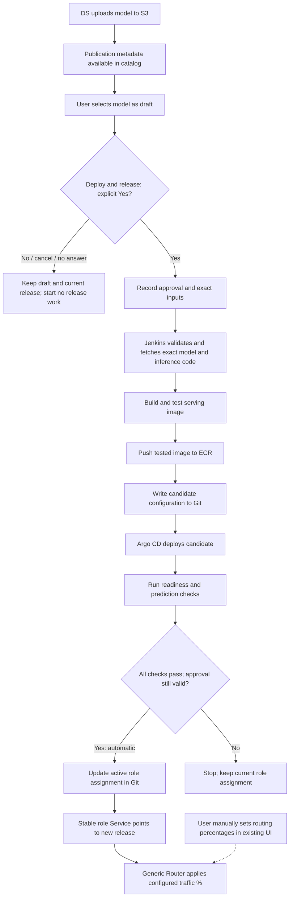

# NCM MLOps Implementation Plan

## 1. Goal

The NCM deployment flow starts when the Data Science team uploads a completed model to S3.

Uploading a model does **not** automatically build, deploy, or release it. The upload only makes the model available for selection.

The Board member or authorized delegate must explicitly approve the selected version in the UI **before any release processing starts**. In this plan, "user" means that authorized decision-maker.

The intended user flow is:

```text
Select model version
    |
    v
Confirm Deploy & release = Yes
    |
    v
Automatically build, test, and deploy the approved version
    |
    v
Automatically validate and activate it after all checks pass
```

**No, cancel, or no answer means no release job starts.** Selection only saves a draft. There is no build, artifact download, validation job, deployment, or other background release work before explicit **Yes**.

That single approval authorizes the complete operation. There is no second approval after deployment. Existing production services and monitoring continue running throughout.

Model training is outside the scope of this plan.

For each serving release, the selected model artifact must be packaged together with the exact inference code and dependencies required by that model.

The MLOps platform should automate the technical steps. Users should trigger the process through the UI rather than asking engineers to manually update deployment files for each release.

---

## 2. Main Principles

### 2.1 Put explicit approval before all release processing

Selection is a draft action. Build, deployment, validation, and activation are automated stages of one approved operation.

| Action | Trigger | Result | Can it receive application traffic? |
|---|---|---|---|
| Publish | DS completes the S3 upload | Model is available to list in the catalog; no release job | No |
| Select / save draft | User chooses a model version and role | Draft selection is saved; no release job | No |
| No / cancel / no answer | Explicit Yes has not been given | Remain in draft; no release work starts | No |
| Approve | User confirms **Deploy & release = Yes** | Backend records the exact approved request and starts the pipeline | No |
| Build, deploy, and validate | Approved pipeline runs automatically | Tested image and isolated candidate are prepared | No |
| Activate | Candidate passes all checks and the approval is still valid | Automation switches the selected role Service | Yes, according to existing routing settings |
| Set traffic | User changes Generic Router percentages | Router applies the selected distribution | Only released models receive traffic |

Changing the draft selection must not start Jenkins, download model artifacts, run validation jobs, build images, write deployment changes to Git, or create Kubernetes resources.

For example, if the user selects `3.5`, then changes the draft to `3.6`, neither version is prepared until the user explicitly approves **Yes** for `3.6`.

The UI can use a **Deploy & release** action with a confirmation dialog:

```text
Deploy and release Challenger 3.6 in this environment?

No  -> keep draft; start nothing
Yes -> build, test, deploy, validate, then activate automatically
```

Approval defaults to **No** and must never be inherited by a different model, code revision, environment, or role. There must be no separate button that starts preparation before this approval.

---

### 2.2 Package the model and inference code together

The current runtime downloads the model from S3 when FastAPI starts.

The target design changes this behavior.

Each serving release should contain:

- the exact model artifact;
- the matching inference code;
- locked dependencies;
- release metadata.

This is important because a new model may require changes in:

- feature retrieval;
- preprocessing;
- feature ordering;
- prediction logic;
- dependency versions.

A model version by itself does not fully describe the serving behavior.

The model and inference code must therefore be versioned and tested as one serving release.

| Area | Current approach | Target approach |
|---|---|---|
| ECR image | Prediction runtime only | Model + inference code + locked dependencies |
| Model retrieval | FastAPI downloads from S3 during startup | Jenkins downloads the artifact before the image build |
| FastAPI startup | Download, retry, then load | Load the bundled local model |
| Rollback unit | Runtime + model configuration | Previous tested image digest + recorded configuration |

S3 remains the source of the original model artifacts.

Example:

```text
s3://fcp-model-artifacts/serving/new_customers/2.5.0/
  model.cbm
  model_meta.json
  golden_sample.json
```

Each serving release must record the exact model/code combination.

Example:

```text
Serving release: ncm-3-5-r1

Model version: 3.5
Model location: immutable S3 path
Artifact checksums: recorded

Inference code: <exact-git-commit>
Dependencies: locked
Base image: pinned
Feature contract: recorded

Output image:
<ecr>/ncm-serving@sha256:<image-digest>
```

If the model changes, create a new release.

If the inference code changes, also create a new release.

Example:

```text
ncm-3-5-r1
ncm-3-5-r2
```

Do not overwrite an existing release.

An image may be reused only when the exact same model, code commit, dependency set, and build configuration were already built and tested successfully.

Kubernetes should deploy the image by digest rather than by a mutable tag.

FastAPI must support loading the bundled model from a fixed path such as:

```text
/opt/ncm/model/model.cbm
```

For the new serving-image flow, FastAPI should not fall back to downloading the model from S3.

If the bundled model is missing, incorrect, or cannot be loaded, readiness must fail.

Existing releases may continue using the current S3 download flow during migration.

---

### 2.3 Use Git as the deployment source of truth

Git should store the desired deployment state.

This includes:

- candidate serving releases;
- ECR image digests;
- inference configuration;
- active Champion and Challenger assignments.

Draft selections should be stored separately in the UI/backend database.

Selecting a draft must not change Git or trigger Argo CD.

| User action | Git change | Argo CD result |
|---|---|---|
| Select / save draft | None | No deployment change |
| No / cancel / no answer | None | No deployment change |
| Yes, then successful build and image tests | Pipeline writes candidate release to Git | Candidate Deployment is created |
| Same approved operation passes deployed-candidate checks | Pipeline updates active role assignment in Git | Role Service switches to the approved candidate |

One approved operation produces two automated Git changes:

```text
Deploy & release = Yes
    ↓
Jenkins
    ↓
Candidate Git commit
    ↓
Argo CD
    ↓
Candidate Deployment
    ↓
Candidate validation passes
    ↓
Assignment Git commit (automatic under the same approval)
    ↓
Argo CD
    ↓
Role Service update
```

These Git changes should be automated.

Git holds Helm values and templates; Helm renders Kubernetes manifests, and Argo CD reconciles them into Kubernetes. A YAML file's role depends on its location and contents: values configure the chart, templates generate resources, and rendered manifests describe Deployments and Services.

The MLOps engineer should configure the pipeline, repository permissions, Helm templates, and Argo CD integration once. Normal releases should not require manual YAML edits.

If repository policy requires a human review of each generated commit, that is an additional manual gate and must be documented separately; it is not assumed in this target flow.

---

### 2.4 Keep Champion and Challenger endpoints stable

The existing Kubernetes Service names should remain unchanged.

Example:

```text
http://new-customers-model.fcp-dev.svc.cluster.local
http://new-customers-model-challenger.fcp-dev.svc.cluster.local
```

These DNS names represent roles:

```text
new-customers-model             = Champion
new-customers-model-challenger  = Challenger
```

They do not represent a specific model version.

A candidate release should have its own Deployment and release labels.

Before approval, no candidate is prepared. After approval, the current Champion and Challenger Services continue to point to the currently released versions while the candidate is built, deployed, and checked.

The candidate may receive internal synthetic validation requests, but it must not receive normal application traffic.

After all candidate checks pass, automation updates the Service selector under the original approval. Selectors should use a unique serving-release ID, because a model version can have several inference-code revisions.

Example:

```text
Before release

new-customers-model-challenger
        |
        +--> serving-release=ncm-3-4-r1
```

```text
After release

new-customers-model-challenger
        |
        +--> serving-release=ncm-3-6-r1
```

The DNS name stays the same. Only the selected backend changes.

---

## 3. End-to-End Flow



Any build or deployment failure also stops the operation before activation.

> **No explicit Yes means no release processing. Yes starts the full automated operation; successful checks allow activation without another approval.**

---

## 4. Publish and Select a Draft

After the DS upload is complete, the publication metadata can be listed in the catalog. The DS publishing script may register that metadata as part of publishing. This does not enqueue a release job.

The catalog entry should include:

- model family;
- model version;
- S3 location;
- artifact checksums;
- publication ID;
- inference-code/build mapping.

If the inference-code mapping is missing, the model may appear in the catalog but must be marked incomplete.

**Deploy & release = Yes** must remain blocked until the mapping is available. Catalog display and draft persistence use metadata; they must not trigger artifact downloads or background preparation. Full compatibility and artifact verification happen only after approval.

Publishing a model must not:

- start Jenkins;
- download artifacts or run background validation;
- build an image;
- update deployment configuration;
- create Kubernetes resources;
- change the current release.

The UI should show the current released version separately from the draft.

Example:

```text
Current Challenger: 3.4
Draft Challenger:   3.5
```

If the user changes the draft to `3.6`, production remains on `3.4`.

Only the exact version and code combination captured when **Yes** is confirmed may be prepared.

---

## 5. Automated Execution After Yes

Only after the user confirms **Deploy & release = Yes**, the backend records the approval, creates a tracked operation, and enqueues Jenkins. There is no upload-triggered, draft-triggered, or speculative preparation pipeline.

The operation should record:

- environment;
- selected role;
- model version;
- artifact location;
- artifact checksums;
- inference-code Git commit;
- build definition revision;
- draft revision;
- operation ID;
- approver and approval timestamp;
- current role assignment and routing settings shown during approval.

The backend must enforce this gate for every start/retry API, not only in the UI. Duplicate clicks must return the same operation rather than start duplicate builds. A changed draft cannot replace an operation's captured inputs; a different target requires a new explicit Yes. Serialize operations for the same environment and role, and recheck the expected active assignment before switching it.

The approved pipeline then runs the following steps.

### Step 1 — Validate the release definition

Verify:

- model/code compatibility mapping;
- immutable artifact path;
- checksums;
- feature contract;
- dependency definition;
- build configuration.

If validation fails, stop the operation.

The currently released Champion and Challenger must remain unchanged.

### Step 2 — Fetch exact inputs

Jenkins:

- checks out the exact inference-code commit;
- downloads the exact model files from S3;
- verifies required files and checksums.

Retries must use the same captured inputs.

The pipeline must not silently replace the requested model, branch, dependency version, or base image with a newer one.

### Step 3 — Build the serving image

The image should contain:

- inference code;
- locked dependencies;
- model artifact;
- model metadata;
- release identity.

The golden sample can be included as a validation resource.

### Step 4 — Test the image

Start the packaged FastAPI service and verify:

- the bundled model loads successfully;
- startup does not depend on S3 model download;
- the expected model identity is loaded;
- golden-sample predictions succeed;
- request/response format matches Generic Router expectations;
- feature names, types, and ordering are correct;
- required feature-service integrations are available.

If the selected model needs a new feature that is not available in the target environment, stop the operation before activation.

### Step 5 — Push the tested image to ECR

Push the image to ECR and record:

- image digest;
- model version;
- inference-code commit;
- build inputs;
- build result;
- operation ID.

If an identical tested release already exists, the existing image may be reused.

### Step 6 — Write candidate configuration to Git

Jenkins writes the candidate release to Git.

This change must not modify the active Champion or Challenger assignment.

The candidate should have unique release labels so that multiple releases of the same model version cannot accidentally share production traffic.

### Step 7 — Deploy the candidate

Argo CD detects the Git change and creates the candidate Deployment.

Kubernetes pulls the exact ECR image digest.

FastAPI loads the bundled local model.

### Step 8 — Validate the deployed candidate

Verify:

- Pods are Ready;
- expected image digest is running;
- expected model version is loaded;
- expected inference-code version is running;
- sample predictions pass;
- required capacity is available.

If all checks pass, the candidate is technically ready. The backend rechecks the original approval and captured inputs, then automatically continues to activation:

```text
Validating -> Activating -> Released
```

Readiness is an internal checkpoint, not a waiting state for a second user approval. Until the assignment update in section 7, the candidate remains isolated from live and mirrored application traffic.

---

## 6. UI States

The UI should use clear lifecycle states.

| State | Meaning | Next action |
|---|---|---|
| Published | Model is registered in the catalog | Select |
| Draft / awaiting approval | User selected the model; no release work has started | Review and explicitly confirm Yes, or remain in draft |
| Approved / queued | Yes is recorded for exact inputs | Pipeline starts automatically |
| Preparing | Approved build and deployment are running | Wait or inspect failure |
| Validating | Automated checks run against the isolated candidate | Automatically activate if checks and approval remain valid |
| Activating | Role assignment is being applied under the original approval | Wait for verification |
| Released | Candidate is active behind the role Service | Monitor / adjust traffic |
| Failed | Preparation or release failed | Review and retry |

The UI should show separately:

- current released version;
- current draft version;
- approved operation's exact target and serving release identity;
- operation status.

A successful build alone is insufficient: deployment, readiness, prediction checks, and approval verification must all pass. After they pass, activation is automatic within the approved operation.

Selecting No or closing the confirmation leaves the model in draft. The only approval comes before the pipeline starts.

---

## 7. Upfront Approval and Automatic Activation

Before any release job starts, the UI should show:

- target environment;
- selected role;
- selected model version, artifact identity, and exact inference-code revision;
- current released version;
- current routing percentage;
- current live/shadow routing state.

The user must explicitly confirm:

```text
Deploy & release = Yes
```

The confirmation must explain that Yes starts build and deployment and authorizes activation after successful checks. If the role currently has traffic, the approved model will inherit that traffic share when activated. The user can adjust routing separately before approving if required.

No, cancel, or no answer starts nothing. The current release stays active. Approval is never inferred from saving a selection, an S3 event, a Slack message, or an existing approval for a different revision.

After the approved pipeline in section 5 passes all checks, the backend should automatically:

1. verify the candidate is still healthy and its prediction checks passed;
2. confirm that the original approval is valid for the exact prepared release and the expected role assignment has not changed;
3. update the role assignment in Git;
4. wait for Argo CD reconciliation;
5. verify the Kubernetes Service selector;
6. verify the selected backend Pods are Ready;
7. verify the expected model is actually serving;
8. mark the operation Released only after observed state matches desired state.

The audit record should include:

- actor;
- release ID;
- previous release;
- target role;
- approval timestamp and approved inputs;
- candidate and assignment Git revisions;
- timestamp;
- result.

### Existing traffic must be preserved

Release changes the model behind the role endpoint.

It does not automatically change Generic Router percentages.

Example:

```text
Before release

Challenger -> 3.4
Traffic    -> 10%
```

After releasing `3.6`:

```text
Challenger -> 3.6
Traffic    -> 10%
```

If Challenger traffic is `0%`, the Service can switch to the new release while live traffic remains `0%`.

Selecting No or canceling before approval requires no rollback because no release work has started. Canceling an operation after Yes is a separate action: automation must stop safely and reconcile any Git changes already made. It must not claim that already-applied changes were undone merely because a job was canceled.

---

## 8. Routing Percentage Is a Separate Control

The existing Generic Router UI should continue to control traffic.

Example:

```text
Champion   90%
Challenger 10%
```

Changing traffic percentage must not:

- build a new image;
- deploy a candidate;
- change the draft selection;
- release a model.

The release workflow must also not modify traffic percentages automatically.

This keeps two responsibilities separate:

```text
Model release
    = Which model is behind Champion / Challenger?

Routing policy
    = How much traffic goes to Champion / Challenger?
```

Before activation, the candidate must receive no normal live or mirrored application traffic.

Internal synthetic validation traffic is allowed only during the approved pipeline. Approval is required even if the selected role currently has 0% traffic.

---

## 9. Failure Handling, Promotion, and Rollback

### Failure handling

If any preparation step fails, active role assignments must stay unchanged.

Examples:

- validation failure;
- S3 download failure;
- image build failure;
- ECR push/pull failure;
- local model-load failure;
- readiness failure;
- prediction validation failure.

The UI should show:

- failed stage;
- failure reason;
- operation ID;
- retry option.

If a failure happens during activation after the Git assignment has already changed, the UI should show both:

```text
Desired assignment
Observed assignment
```

The platform must verify actual state instead of assuming that the change either fully succeeded or fully failed.

Retries must remain within the original approved inputs. A different model, code revision, environment, or role requires a fresh Yes. Repeated requests must not create competing operations or allow a stale operation to overwrite a newer assignment.

---

### Promotion

Promotion uses the same standard release process.

Example:

```text
Champion   -> 3.4
Challenger -> 3.6
```

To promote `3.6`:

1. select `3.6` for Champion;
2. explicitly confirm **Deploy & release = Yes** for Champion;
3. only then reuse the tested serving release, or build/deploy it if required;
4. automatically activate it after checks pass under that approval;
5. verify the Champion Service;
6. keep routing changes as a separate user decision.

Promotion should not happen automatically based only on monitoring results.

---

### Rollback

Rollback also uses the normal release mechanism.

Select the previous release and explicitly confirm Yes before rollback processing starts. An existing image or Deployment does not bypass approval.

Use the previous tested image digest together with its recorded configuration.

Do not rebuild an old release from the current Git branch.

Keep previous releases available for a defined rollback period.

Do not remove an image or Deployment when it is:

- actively assigned;
- being prepared;
- being released;
- draining;
- retained for rollback.

Because Service updates are asynchronous, old Pods may continue handling existing connections for a short period.

Verify the new assignment before removing previous capacity.

---

## 10. Example: Challenger 3.4 → 3.5 → 3.6

| Action | Result | Active Challenger |
|---|---|---|
| DS uploads `3.5` and `3.6` | Both appear in the catalog | `3.4` |
| User selects `3.5` | Draft only | `3.4` |
| User changes draft to `3.6` | Draft changes only | `3.4` |
| User selects No, cancels, or does nothing | No background release processing starts | `3.4` |
| User explicitly confirms Deploy & release = Yes for `3.6` | Approval is recorded; only `3.6` starts preparation | `3.4` |
| Pipeline builds, tests, and deploys `3.6` | Isolated candidate is checked automatically | `3.4` |
| All checks pass and approval is still valid | Automation switches the Challenger Service; no second approval | `3.6` |

This example shows the main behavior:

> **Before Yes: draft only, no preparation. After Yes: build, deploy, validate, and activate automatically.**

---

## 11. Component Responsibilities

| Component | Responsibility |
|---|---|
| DS publisher / S3 | Store immutable model artifacts, metadata, checksums, and validation samples |
| Inference-code owner | Maintain versioned inference/feature logic and define model-code compatibility |
| Model UI / backend | Manage drafts, enforce upfront Yes, capture approved inputs, track operations, automate activation, and audit |
| Jenkins | Run only after approval: fetch exact inputs, build/test image, push to ECR, and write candidate configuration |
| ECR | Store immutable tested serving images |
| Git / Helm | Store candidate releases and active role assignments |
| Argo CD | Reconcile Git state into Kubernetes |
| Kubernetes | Run candidate/released Deployments and stable role Services |
| FastAPI | Load bundled model and provide readiness/prediction endpoints |
| Generic Router | Control Champion/Challenger traffic distribution |
| Prometheus / Grafana | Monitor health, errors, latency, routing, and model identity |

---

## 12. Existing Components and New Work

### Existing components

The following pieces already exist:

- DS model upload to S3;
- FastAPI runtime with S3 model download;
- Generic Router traffic configuration;
- stable Champion and Challenger Service endpoints.

### New implementation work

The new design requires:

- model-to-inference-code mapping;
- serving release definition;
- combined model + inference-code image build;
- FastAPI local bundled-model loading;
- model catalog and draft-selection behavior;
- one **Deploy & release** UI/backend action with explicit Yes before any release processing;
- backend approval enforcement and automatic activation after successful checks;
- candidate deployment workflow;
- release operation tracking;
- retry and deduplication handling;
- audit history.

Jenkins, Git, Helm, and Argo CD integration should be verified before the full workflow is considered implemented.

---

## 13. First Release Plan

The first implementation should use one NCM candidate and prove the complete lifecycle.

### Phase 1

1. DS uploads one NCM model to S3.
2. The model is registered in the catalog.
3. The exact inference-code mapping is added.
4. User selects the model as a draft.
5. Verify that selecting No, closing the dialog, or waiting starts no background release work.
6. User reviews the exact target and explicitly confirms **Deploy & release = Yes**.
7. The backend records approval and starts Jenkins with the captured inputs.
8. Jenkins fetches and verifies inputs, then builds the combined serving image.
9. Jenkins tests the image and pushes it to ECR.
10. Jenkins writes the candidate configuration to Git.
11. Argo CD deploys the candidate; FastAPI loads the local bundled model.
12. Automated readiness and prediction checks pass.
13. The backend rechecks the original approval and automatically updates the role assignment in Git.
14. Argo CD updates the stable Service.
15. The platform verifies the actual serving version and marks it Released.
16. The existing Generic Router UI controls traffic percentages as a separate human decision.
17. The team monitors the release.
18. Promotion or rollback requires a new upfront Yes for that operation.

This first phase should prove the main lifecycle before adding more advanced automation.

---

## 14. First-Release Acceptance Criteria

The first implementation is complete when:

1. Uploading or cataloging a model starts no background release work.
2. Selecting or changing a draft starts no Jenkins job, artifact download, validation job, image build, deployment Git change, or Kubernetes change.
3. No, cancel, and no answer leave the current release unchanged and enqueue nothing.
4. Jenkins uses the exact model, code commit, dependencies, and build definition.
5. The ECR image contains both the model and compatible inference code.
6. Candidate startup does not require S3 model access.
7. Missing or invalid bundled model files cause readiness to fail.
8. A candidate can be created even when no Deployment for that model version already exists.
9. Only explicit **Yes** starts processing; direct backend calls and retries cannot bypass approval.
10. Approval defaults to **No** and is bound to the exact reviewed model, code, environment, role, and draft revision.
11. After Yes, build, deploy, validation, and activation run automatically; there is no second approval after readiness. Candidates receive no application traffic until activation, and failed checks prevent the role switch.
12. Release keeps the same stable Champion/Challenger DNS names.
13. Release does not change Generic Router percentages.
14. Model or inference-code changes create a new serving release identity.
15. Rollback uses the previous tested image digest and saved configuration.
16. Draft edits cannot replace approved inputs; duplicate or stale operations cannot activate an unintended release.
17. Approval is required before processing even when an image already exists or the role has 0% traffic.

---

## 15. Target Operating Model

```text
DS publishes model
        ↓
Model appears in catalog
        ↓
User selects draft
        ↓
User explicitly confirms Deploy & release = Yes
        ↓
Backend records exact approval and starts the pipeline
        ↓
Jenkins builds and tests exact model + code
        ↓
Image is pushed to ECR
        ↓
Git + Argo CD deploy candidate
        ↓
Candidate passes automated validation
        ↓
Stable role Service automatically switches to approved release
        ↓
Generic Router keeps the configured traffic %
        ↓
Monitor
        ↓
Promote or rollback through the same process
```

Main principle:

> **Without explicit Yes, no release processing starts. With Yes, the system builds, deploys, validates, and activates the exact approved version.**

The platform automates the technical execution.

The user remains responsible for:

- model selection;
- explicit Yes before any release processing;
- traffic percentage;
- promotion;
- rollback.
