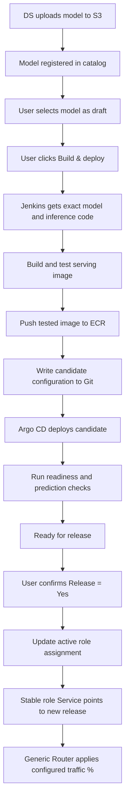

# NCM MLOps Implementation Plan

## 1. Goal

The NCM deployment flow starts when the Data Science team uploads a completed model to S3.

Uploading a model does **not** automatically build, deploy, or release it. The upload only makes the model available for selection.

The intended user flow is:

```text
Select model version
    ↓
Click Build & deploy
    ↓
Wait for Ready for release
    ↓
Confirm Release = Yes
```

Model training is outside the scope of this plan.

For each serving release, the selected model artifact must be packaged together with the exact inference code and dependencies required by that model.

The MLOps platform should automate the technical steps. Users should trigger the process through the UI rather than asking engineers to manually update deployment files for each release.

---

## 2. Main Principles

### 2.1 Separate selection, preparation, deployment, and release

The main lifecycle stages must stay separate.

| Action | Trigger | Result | Can it receive application traffic? |
|---|---|---|---|
| Publish | DS completes the S3 upload | Model appears in the catalog | No |
| Select / save draft | User chooses a model version and role | Draft selection is saved | No |
| Build & deploy | User clicks **Build & deploy** | Jenkins builds the serving image and Argo CD deploys the candidate | No |
| Ready for release | Candidate passes deployment and validation checks | Candidate is ready for approval | No |
| Release | User confirms **Release = Yes** | Candidate becomes active behind the selected role Service | Yes |
| Set traffic | User changes Generic Router percentages | Router applies the selected distribution | Only released models receive traffic |

Changing the draft selection must not start a build or deployment.

For example, if the user selects `3.5`, then changes the draft to `3.6`, only `3.6` should be prepared when **Build & deploy** is clicked.

**Build & deploy** is one UI action that starts two automated stages:

1. build and test the serving image;
2. deploy and validate the candidate.

**Release** is a separate approval step.

Release must default to **No** and must never be inherited from a previous selection.

---

### 2.2 Package the model and inference code together

The current runtime downloads the model from S3 when FastAPI starts.

The target design changes this behavior.

Each serving release should contain:

- the exact model artifact;
- the matching inference code;
- locked dependencies;
- release metadata.

This is important because a new model may require changes in:

- feature retrieval;
- preprocessing;
- feature ordering;
- prediction logic;
- dependency versions.

A model version by itself does not fully describe the serving behavior.

The model and inference code must therefore be versioned and tested as one serving release.

| Area | Current approach | Target approach |
|---|---|---|
| ECR image | Prediction runtime only | Model + inference code + locked dependencies |
| Model retrieval | FastAPI downloads from S3 during startup | Jenkins downloads the artifact before the image build |
| FastAPI startup | Download, retry, then load | Load the bundled local model |
| Rollback unit | Runtime + model configuration | Previous tested image digest + recorded configuration |

S3 remains the source of the original model artifacts.

Example:

```text
s3://fcp-model-artifacts/serving/new_customers/2.5.0/
  model.cbm
  model_meta.json
  golden_sample.json
```

Each serving release must record the exact model/code combination.

Example:

```text
Serving release: ncm-3-5-r1

Model version: 3.5
Model location: immutable S3 path
Artifact checksums: recorded

Inference code: <exact-git-commit>
Dependencies: locked
Base image: pinned
Feature contract: recorded

Output image:
<ecr>/ncm-serving@sha256:<image-digest>
```

If the model changes, create a new release.

If the inference code changes, also create a new release.

Example:

```text
ncm-3-5-r1
ncm-3-5-r2
```

Do not overwrite an existing release.

An image may be reused only when the exact same model, code commit, dependency set, and build configuration were already built and tested successfully.

Kubernetes should deploy the image by digest rather than by a mutable tag.

FastAPI must support loading the bundled model from a fixed path such as:

```text
/opt/ncm/model/model.cbm
```

For the new serving-image flow, FastAPI should not fall back to downloading the model from S3.

If the bundled model is missing, incorrect, or cannot be loaded, readiness must fail.

Existing releases may continue using the current S3 download flow during migration.

---

### 2.3 Use Git as the deployment source of truth

Git should store the desired deployment state.

This includes:

- candidate serving releases;
- ECR image digests;
- inference configuration;
- active Champion and Challenger assignments.

Draft selections should be stored separately in the UI/backend database.

Selecting a draft must not change Git or trigger Argo CD.

| User action | Git change | Argo CD result |
|---|---|---|
| Select / save draft | None | No deployment change |
| Build & deploy | Candidate release is written to Git | Candidate Deployment is created |
| Release = Yes | Active role assignment is updated in Git | Role Service switches to the approved candidate |

Candidate preparation:

```text
Build & deploy
    ↓
Jenkins
    ↓
Candidate Git commit
    ↓
Argo CD
    ↓
Candidate Deployment
```

Release:

```text
Release = Yes
    ↓
Release backend
    ↓
Assignment Git commit
    ↓
Argo CD
    ↓
Role Service update
```

These Git changes should be automated.

The MLOps engineer should configure the pipeline, repository permissions, Helm templates, and Argo CD integration once. Normal releases should not require manual YAML edits.

---

### 2.4 Keep Champion and Challenger endpoints stable

The existing Kubernetes Service names should remain unchanged.

Example:

```text
http://new-customers-model.fcp-dev.svc.cluster.local
http://new-customers-model-challenger.fcp-dev.svc.cluster.local
```

These DNS names represent roles:

```text
new-customers-model             = Champion
new-customers-model-challenger  = Challenger
```

They do not represent a specific model version.

A candidate release should have its own Deployment and release labels.

Before Release approval, the current Champion and Challenger Services must continue to point to the currently released versions.

The candidate may receive internal synthetic validation requests, but it must not receive normal application traffic.

At release time, automation updates the Service selector.

Example:

```text
Before release

new-customers-model-challenger
        |
        +--> model-version=3.4
```

```text
After release

new-customers-model-challenger
        |
        +--> model-version=3.6
```

The DNS name stays the same. Only the selected backend changes.

---

## 3. End-to-End Flow



The key rule is:

> **A model can be selected and prepared without changing production traffic. Production changes only after explicit Release approval.**

---

## 4. Publish and Select a Draft

After the DS upload is complete, the publishing process registers the model in the catalog.

The catalog entry should include:

- model family;
- model version;
- S3 location;
- artifact checksums;
- publication ID;
- inference-code/build mapping.

If the inference-code mapping is missing, the model may appear in the catalog but must be marked incomplete.

**Build & deploy** must remain blocked until the mapping is available.

Publishing a model must not:

- start Jenkins;
- build an image;
- update deployment configuration;
- create Kubernetes resources;
- change the current release.

The UI should show the current released version separately from the draft.

Example:

```text
Current Challenger: 3.4
Draft Challenger:   3.5
```

If the user changes the draft to `3.6`, production remains on `3.4`.

Only the version captured when **Build & deploy** is clicked should be prepared.

---

## 5. Build & Deploy

When the user clicks **Build & deploy**, the backend creates a tracked operation and captures the exact request.

The operation should record:

- environment;
- selected role;
- model version;
- artifact location;
- artifact checksums;
- inference-code Git commit;
- build definition revision;
- draft revision;
- operation ID.

The pipeline then runs the following steps.

### Step 1 — Validate the release definition

Verify:

- model/code compatibility mapping;
- immutable artifact path;
- checksums;
- feature contract;
- dependency definition;
- build configuration.

If validation fails, stop the operation.

The currently released Champion and Challenger must remain unchanged.

### Step 2 — Fetch exact inputs

Jenkins:

- checks out the exact inference-code commit;
- downloads the exact model files from S3;
- verifies required files and checksums.

Retries must use the same captured inputs.

The pipeline must not silently replace the requested model, branch, dependency version, or base image with a newer one.

### Step 3 — Build the serving image

The image should contain:

- inference code;
- locked dependencies;
- model artifact;
- model metadata;
- release identity.

The golden sample can be included as a validation resource.

### Step 4 — Test the image

Start the packaged FastAPI service and verify:

- the bundled model loads successfully;
- startup does not depend on S3 model download;
- the expected model identity is loaded;
- golden-sample predictions succeed;
- request/response format matches Generic Router expectations;
- feature names, types, and ordering are correct;
- required feature-service integrations are available.

If the selected model needs a new feature that is not available in the target environment, the candidate must not become Ready for release.

### Step 5 — Push the tested image to ECR

Push the image to ECR and record:

- image digest;
- model version;
- inference-code commit;
- build inputs;
- build result;
- operation ID.

If an identical tested release already exists, the existing image may be reused.

### Step 6 — Write candidate configuration to Git

Jenkins writes the candidate release to Git.

This change must not modify the active Champion or Challenger assignment.

The candidate should have unique release labels so that multiple releases of the same model version cannot accidentally share production traffic.

### Step 7 — Deploy the candidate

Argo CD detects the Git change and creates the candidate Deployment.

Kubernetes pulls the exact ECR image digest.

FastAPI loads the bundled local model.

### Step 8 — Validate the deployed candidate

Verify:

- Pods are Ready;
- expected image digest is running;
- expected model version is loaded;
- expected inference-code version is running;
- sample predictions pass;
- required capacity is available.

If all checks pass, mark the candidate:

```text
Ready for release
```

The candidate is now prepared, but it is still not active behind the Champion or Challenger Service.

---

## 6. UI States

The UI should use clear lifecycle states.

| State | Meaning | Next action |
|---|---|---|
| Published | Model is registered in the catalog | Select |
| Draft | User selected the model for a role | Build & deploy |
| Preparing | Build/deployment/validation is running | Wait or inspect failure |
| Ready for release | Candidate is deployed and verified | Approve Release |
| Releasing | Role assignment is being applied | Wait for verification |
| Released | Candidate is active behind the role Service | Monitor / adjust traffic |
| Failed | Preparation or release failed | Review and retry |

The UI should show separately:

- current released version;
- current draft version;
- prepared serving release;
- operation status.

A successful Jenkins build must not automatically release the model.

A healthy candidate Deployment must also not automatically release the model.

Release approval must be enforced by the backend, not only by UI controls.

---

## 7. Release Approval

Before the user approves a release, the UI should show:

- target environment;
- selected role;
- prepared serving release;
- current released version;
- current routing percentage;
- current live/shadow routing state.

The user must explicitly confirm:

```text
Release = Yes
```

After approval, the backend should:

1. verify the candidate is still Ready for release;
2. confirm that approval matches the exact prepared release;
3. update the role assignment in Git;
4. wait for Argo CD reconciliation;
5. verify the Kubernetes Service selector;
6. verify the selected backend Pods are Ready;
7. verify the expected model is actually serving;
8. mark the operation Released only after observed state matches desired state.

The audit record should include:

- actor;
- release ID;
- previous release;
- target role;
- Git revision;
- timestamp;
- result.

### Existing traffic must be preserved

Release changes the model behind the role endpoint.

It does not automatically change Generic Router percentages.

Example:

```text
Before release

Challenger -> 3.4
Traffic    -> 10%
```

After releasing `3.6`:

```text
Challenger -> 3.6
Traffic    -> 10%
```

If Challenger traffic is `0%`, the Service can switch to the new release while live traffic remains `0%`.

If the user cancels, selects No, or takes no action, the currently released version remains active.

---

## 8. Routing Percentage Is a Separate Control

The existing Generic Router UI should continue to control traffic.

Example:

```text
Champion   90%
Challenger 10%
```

Changing traffic percentage must not:

- build a new image;
- deploy a candidate;
- change the draft selection;
- release a model.

The release workflow must also not modify traffic percentages automatically.

This keeps two responsibilities separate:

```text
Model release
    = Which model is behind Champion / Challenger?

Routing policy
    = How much traffic goes to Champion / Challenger?
```

Before release, the candidate must receive no normal live or mirrored application traffic.

Internal synthetic validation traffic is allowed.

---

## 9. Failure Handling, Promotion, and Rollback

### Failure handling

If any preparation step fails, active role assignments must stay unchanged.

Examples:

- validation failure;
- S3 download failure;
- image build failure;
- ECR push/pull failure;
- local model-load failure;
- readiness failure;
- prediction validation failure.

The UI should show:

- failed stage;
- failure reason;
- operation ID;
- retry option.

If a failure happens during Release after the Git assignment has already changed, the UI should show both:

```text
Desired assignment
Observed assignment
```

The platform must verify actual state instead of assuming that the change either fully succeeded or fully failed.

---

### Promotion

Promotion uses the same standard release process.

Example:

```text
Champion   -> 3.4
Challenger -> 3.6
```

To promote `3.6`:

1. select `3.6` for Champion;
2. reuse the tested serving release if it already exists;
3. prepare it only if required;
4. confirm **Release = Yes** for Champion;
5. verify the Champion Service;
6. keep routing changes as a separate user decision.

Promotion should not happen automatically based only on monitoring results.

---

### Rollback

Rollback also uses the normal release mechanism.

Use the previous tested image digest together with its recorded configuration.

Do not rebuild an old release from the current Git branch.

Keep previous releases available for a defined rollback period.

Do not remove an image or Deployment when it is:

- actively assigned;
- being prepared;
- being released;
- draining;
- retained for rollback.

Because Service updates are asynchronous, old Pods may continue handling existing connections for a short period.

Verify the new assignment before removing previous capacity.

---

## 10. Example: Challenger 3.4 → 3.5 → 3.6

| Action | Result | Active Challenger |
|---|---|---|
| DS uploads `3.5` and `3.6` | Both appear in the catalog | `3.4` |
| User selects `3.5` | Draft only | `3.4` |
| User changes draft to `3.6` | Draft changes only | `3.4` |
| User clicks Build & deploy for `3.6` | Only `3.6` is prepared | `3.4` |
| `3.6` passes validation | `3.6` becomes Ready for release | `3.4` |
| User confirms Release = Yes | Challenger Service switches to `3.6` | `3.6` |

This example shows the main behavior:

> **Changing a draft does not affect production. Only Build & deploy prepares a release, and only Release approval activates it.**

---

## 11. Component Responsibilities

| Component | Responsibility |
|---|---|
| DS publisher / S3 | Store immutable model artifacts, metadata, checksums, and validation samples |
| Inference-code owner | Maintain versioned inference/feature logic and define model-code compatibility |
| Model UI / backend | Manage drafts, Build & deploy, Release approval, operation state, concurrency, and audit |
| Jenkins | Fetch exact inputs, build/test image, push to ECR, and write candidate configuration |
| ECR | Store immutable tested serving images |
| Git / Helm | Store candidate releases and active role assignments |
| Argo CD | Reconcile Git state into Kubernetes |
| Kubernetes | Run candidate/released Deployments and stable role Services |
| FastAPI | Load bundled model and provide readiness/prediction endpoints |
| Generic Router | Control Champion/Challenger traffic distribution |
| Prometheus / Grafana | Monitor health, errors, latency, routing, and model identity |

---

## 12. Existing Components and New Work

### Existing components

The following pieces already exist:

- DS model upload to S3;
- FastAPI runtime with S3 model download;
- Generic Router traffic configuration;
- stable Champion and Challenger Service endpoints.

### New implementation work

The new design requires:

- model-to-inference-code mapping;
- serving release definition;
- combined model + inference-code image build;
- FastAPI local bundled-model loading;
- model catalog and draft-selection behavior;
- **Build & deploy** UI/backend action;
- separate **Release** approval;
- candidate deployment workflow;
- release operation tracking;
- retry and deduplication handling;
- audit history.

Jenkins, Git, Helm, and Argo CD integration should be verified before the full workflow is considered implemented.

---

## 13. First Release Plan

The first implementation should use one NCM candidate and prove the complete lifecycle.

### Phase 1

1. DS uploads one NCM model to S3.
2. The model is registered in the catalog.
3. The exact inference-code mapping is added.
4. User selects the model as a draft.
5. User clicks **Build & deploy**.
6. Jenkins builds the combined serving image.
7. Jenkins tests the image and pushes it to ECR.
8. Jenkins writes the candidate configuration to Git.
9. Argo CD deploys the candidate.
10. Automated checks mark it **Ready for release**.
11. User reviews the prepared release.
12. User confirms **Release = Yes**.
13. The backend updates the role assignment in Git.
14. Argo CD updates the stable Service.
15. The platform verifies the actual serving version.
16. The existing Generic Router UI controls the traffic percentage.
17. The team monitors the release.
18. Promotion or rollback follows the same release process.

This first phase should prove the main lifecycle before adding more advanced automation.

---

## 14. First-Release Acceptance Criteria

The first implementation is complete when:

1. Uploading a model does not automatically build or deploy it.
2. Changing a draft does not change active traffic.
3. Only the version captured by **Build & deploy** is prepared.
4. Jenkins uses the exact model, code commit, dependencies, and build definition.
5. The ECR image contains both the model and compatible inference code.
6. Candidate startup does not require S3 model access.
7. Missing or invalid bundled model files cause readiness to fail.
8. A candidate can be created even when no Deployment for that model version already exists.
9. A Ready candidate receives no application traffic before Release approval.
10. Release defaults to **No**.
11. Release approval is bound to the exact reviewed serving release.
12. Release keeps the same stable Champion/Challenger DNS names.
13. Release does not change Generic Router percentages.
14. Model or inference-code changes create a new serving release identity.
15. Rollback uses the previous tested image digest and saved configuration.

---

## 15. Target Operating Model

```text
DS publishes model
        ↓
Model appears in catalog
        ↓
User selects draft
        ↓
User clicks Build & deploy
        ↓
Jenkins builds and tests exact model + code
        ↓
Image is pushed to ECR
        ↓
Git + Argo CD deploy candidate
        ↓
Candidate becomes Ready for release
        ↓
User confirms Release = Yes
        ↓
Stable role Service switches to approved release
        ↓
Generic Router keeps the configured traffic %
        ↓
Monitor
        ↓
Promote or rollback through the same process
```

Main principle:

> **Selection does not deploy. Deployment does not release. Release happens only after explicit approval.**

The platform automates the technical execution.

The user remains responsible for:

- model selection;
- Build & deploy request;
- Release approval;
- traffic percentage;
- promotion;
- rollback.
