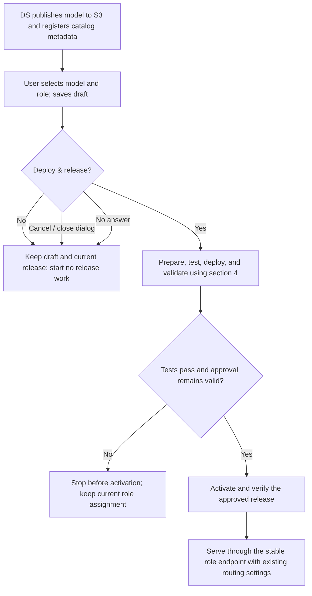
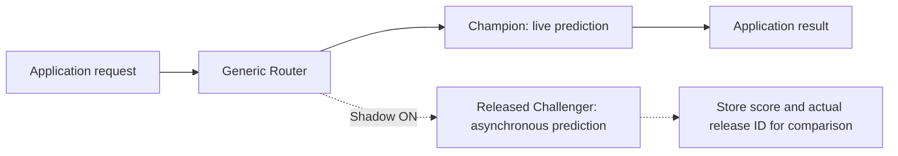

# NCM MLOps Implementation Plan

## 1. Release Flow at a Glance

The platform turns a published NCM model into a tested, running prediction service. Data Science (DS) publishes the model; an authorized user selects and approves it; automation prepares, tests, deploys, and activates the release. Model training is outside this plan.

**Uploading a model or saving a draft starts no release work. Only an explicit `Deploy & release = Yes` starts processing.** That single approval covers activation after successful checks; there is no second human approval.


```mermaid
flowchart TD
    Publish["DS publishes model to S3 and registers catalog metadata"] --> Draft["User selects model and role; saves draft"]
    Draft --> Confirm{"Deploy & release?"}
    Confirm -->|"No"| Hold["Keep draft and current release; start no release work"]
    Confirm -->|"Cancel / close dialog"| Hold
    Confirm -->|"No answer"| Hold
    Confirm -->|"Yes"| Release["Prepare, test, deploy, and validate using section 4"]
    Release --> Checks{"Tests pass and approval remains valid?"}
    Checks -->|"No"| Stop["Stop before activation; keep current role assignment"]
    Checks -->|"Yes"| Activate["Activate and verify the approved release"]
    Activate --> Serve["Serve through the stable role endpoint with existing routing settings"]
```

The main design decisions are:

- A serving release pairs an exact runtime image digest with an immutable S3 model and configuration.
- A container startup script downloads and verifies the model. FastAPI loads the verified local files.
- Git holds deployment configuration. Argo CD applies it; Kubernetes runs the Pods.
- Candidates receive internal synthetic validation requests until activation. Live and shadow application traffic use released models only.
- Model release, live traffic percentages, and shadow ON/OFF are separate controls.

Use [section 4](#4-github-actions-release-workflow) for the complete workflow, tools, inputs, outputs, and tests. Use [section 5](#5-live-routing-and-shadow-execution) for traffic and shadow controls.

## 2. Publication, Approval, and UI State

### Publish and select

After the complete S3 upload succeeds, the DS publishing script registers catalog metadata: model family/version, publication ID, immutable artifact location, checksums, and the compatible inference-code/build mapping. Include an existing runtime image digest when available.

An incomplete mapping may be displayed in the catalog, but release approval stays blocked until the mapping is available. Catalog listing and draft selection use metadata only: they do not download artifacts, validate models, build images, change deployment Git, or create Kubernetes resources.

For example, if the current Challenger is `3.4`, selecting `3.5` and then `3.6` only changes the draft. The current Challenger stays `3.4` until the approved `3.6` release completes.

### Confirm the exact release

The Board member or authorized delegate reviews the environment, role, model/artifact identity, inference-code revision, current release, live percentages, and observed shadow state and target. The confirmation explains that the new release will inherit the role's existing live traffic and, for Challenger, any enabled shadow traffic.

Approval defaults to **No**. No, cancel, closing the dialog, or no response leaves the draft unapproved. Waiting never counts as approval. An existing image, a role with 0% live traffic, or an approval for another revision does not bypass this requirement.

After Yes, the backend records the exact approved inputs and creates an operation ID. Later draft edits cannot change that operation. The backend enforces approval for API calls and retries as well as UI actions; the execution safeguards are defined in section 4.

### Show progress

Keep the current release, draft, approved target/serving-release ID, and operation status visible separately.

| State | Meaning |
|---|---|
| Published | Complete publication metadata is available in the catalog. |
| Draft / awaiting approval | A selection is saved; no release processing has started. |
| Approved / queued | Yes is recorded for the exact inputs. |
| Preparing | Image preparation, model/runtime tests, and candidate deployment are running. |
| Validating | Checks are running against the deployed candidate. |
| Activating | The role assignment is being applied and verified. |
| Released | The observed role endpoint serves the approved release. |
| Failed | Show the failed stage, reason, operation ID, and retry option. |

## 3. Model, Runtime, and Serving Identity

### Keep artifacts separate

| Location | Contents |
|---|---|
| ECR runtime image | FastAPI, inference code, and locked dependencies. Model files, metadata, and golden samples are excluded from the build context and every image layer. |
| S3 | Immutable model files, metadata, checksums, and golden samples with reference inputs/outputs. |
| Deployment Git | Image digest, exact S3 references/checksums, inference configuration, candidate definitions, and active role assignments. |
| Backend | Catalog metadata, drafts, approvals, operation status, and references to release reports and Git revisions. |

Example publication:

```text
s3://<model-artifacts-bucket>/serving/new_customers/3.6/
  model.cbm
  model_meta.json
  golden_sample.json
```

A serving release such as `ncm-3-6-r1` binds the model version and immutable S3 references/checksums to an exact inference-code commit, locked dependencies, pinned base image/build definition, feature contract, runtime image digest, and deployment configuration.

A model or code change creates a new serving release; existing releases are never overwritten. A model-only change may reuse an image built from the same compatible runtime inputs, but the new model/image pair must pass its own tests. Changes to runtime build inputs require a new image. Test and deploy the same ECR digest, such as `<ecr>/ncm-runtime@sha256:<digest>`.

### Prepare the model before starting FastAPI

For the first implementation, move the existing download/retry logic into the container entrypoint. An `initContainer` can be considered later.

1. The entrypoint receives the release ID, model version, exact S3 location, and expected checksums from deployment configuration.
2. It downloads the model into a runtime directory such as `/opt/ncm/model/`, retries as configured, and verifies required files, identity, and checksums.
3. Only after verification succeeds does it start the API server. FastAPI's [lifespan hook](https://fastapi.tiangolo.com/advanced/events/) loads the verified local model before the Pod becomes Ready.
4. The application treats the prepared files as read-only and uses that model for the Pod's lifetime. Changing the model creates a new release.

Failed downloads or verification prevent the API server from starting; load failures prevent application startup. Neither may become Ready or substitute a different model or unverified cached copy. Every new or restarted Pod needs S3 read access through workload identity, with credentials outside the image. Existing healthy Pods continue serving while a candidate starts.

### Keep role endpoints stable

The stable Service names represent roles, not model versions:

| Role | Example endpoint |
|---|---|
| Champion | `http://new-customers-model.fcp-dev.svc.cluster.local` |
| Challenger | `http://new-customers-model-challenger.fcp-dev.svc.cluster.local` |

Each candidate has its own Deployment and unique serving-release labels. Activation changes the role Service selector to that release while preserving the DNS name. Use the full serving-release ID, since one model version may have multiple code revisions. Shadow calls use the released Challenger endpoint.

## 4. GitHub Actions Release Workflow

GitHub Actions coordinates the complete approved release. The backend owns approval and operation state; Argo CD reconciles deployment Git; Kubernetes runs the workloads. This section contains the workflow definition, execution order, testing methodology, and setup requirements.

### 4.1 Workflow location, trigger, and inputs

| Repository | What belongs there |
|---|---|
| Runtime repository | Prediction runtime, Dockerfile, tests, `compose.ncm-test.yml`, and `.github/workflows/ncm-release.yml`. |
| Infrastructure repository | Helm charts, Kubernetes/Argo CD configuration, candidate image/model references, and active role assignments. |
| Router repository | Live/shadow routing logic and its own build/test workflow. A model release does not require a router rebuild. |

The workflow and Compose filenames are implementation targets. Put the workflow in the repository-root `.github/workflows/` directory and configure `workflow_dispatch`, with the definition present on the default branch.

**Exact trigger:** after recording the user's Yes, the backend calls the [workflow dispatch API](https://docs.github.com/en/rest/actions/workflows#create-a-workflow-dispatch-event) with the approved workflow ref and operation ID:

```http
POST /repos/<organization>/<runtime-repository>/actions/workflows/ncm-release.yml/dispatches
Content-Type: application/json

{
  "ref": "<approved-workflow-branch-or-tag>",
  "inputs": { "operation_id": "ncm-op-0042" }
}
```

The workflow retrieves the captured inputs from the backend and verifies approval and the workflow revision before preparation. An S3 upload does not dispatch this workflow. A direct dispatch or rerun cannot create approval or replace approved inputs.

| Captured input | Purpose |
|---|---|
| Environment, role, draft revision, expected current assignment | Identify the target and prevent a stale operation from replacing a newer release. |
| Model version, immutable S3 references, checksums, feature contract, inference configuration | Identify the exact model and expected runtime behavior. |
| Inference-code commit, dependency lock, pinned base image, build definition, existing image digest if reused | Identify compatible runtime inputs. Check out the approved code commit explicitly; it is independent of the workflow ref. |
| Workflow, Compose, test-suite, and golden-sample revisions/checksums and agreed tolerances | Make validation repeatable. |
| Operation ID, approver, approval time, and routing/shadow settings shown during approval | Bind execution to the reviewed request and preserve its audit history. |

Record the image digest produced by a build, workflow run ID/attempt, reports, and Git revisions as execution progresses.

### 4.2 Execution order: input, tool, and output

Implement these stages as dependent jobs in one workflow. Use `needs` to require preceding success and explicit outputs/artifacts to transfer results; jobs must not assume they share local files.

| Step | Input | Tool and action | Required output |
|---|---|---|---|
| 1. Verify inputs | Operation ID and captured release definition | Backend approval check; Git checkout; S3 download into a validation workspace outside the build context. Verify compatibility, required files, checksums, feature contract, and build inputs. | Verified model and runtime inputs for this operation. |
| 2. Prepare image | Exact runtime inputs or compatible existing digest | Docker builds if needed; ECR stores the new image or supplies the existing digest. | One immutable runtime image digest used by all later stages. Publishing an image alone does not validate the release. |
| 3. Test model/runtime pair | Image digest, approved S3 model, golden samples, and test definitions | Docker Compose starts the runtime, test dependencies, and test runner. Run the checks in section 4.3. | Passing report matching the operation and pair; a recorded serving-release identity. |
| 4. Commit candidate | Validated release and matching report | Workflow bot updates candidate configuration in the infrastructure repository. | **Commit 1:** image digest, model references/checksums, release ID, and configuration. Active role assignments stay unchanged. |
| 5. Deploy candidate | Candidate commit on the branch/path tracked by Argo CD | Argo CD applies Helm-rendered resources; Kubernetes creates candidate Pods using the startup sequence in section 3. The workflow waits for the recorded revision and readiness. | Ready candidate isolated from live and shadow application traffic. |
| 6. Validate candidate | Candidate endpoint and expected release identity | Workflow starts a Kubernetes validation Job for identity, prediction, feature-service integration, and capacity checks. | Successful Job and matching deployed-candidate report. |
| 7. Activate | Both passing reports and the original approval | Backend rechecks approval, captured inputs, current run/attempt, candidate health, and expected role assignment. The bot then commits the assignment; Argo CD applies it. | **Commit 2:** stable role Service selects the approved release. Routing settings are preserved. |
| 8. Verify release | Assignment revision and expected serving identity | Workflow waits for reconciliation and checks the actual Service selector, Ready backend Pods, and serving-release identity. | Backend marks **Released** only when observed state matches the approved assignment. |

**Pod creation:** In the default path, step 3 uses Docker containers on the Actions runner. Candidate application Pods are first created in step 5, after tests pass and Argo CD applies commit 1. The validation Job creates test Pods in step 6.

A failed prerequisite stops dependent release stages. Missing, failed, canceled, timed-out, or mismatched validation results block the next gate. Cleanup and diagnostic jobs may still run. Failure before activation preserves the current role assignment; partial activation is handled in section 6.

### 4.3 Testing methodology

**Before deployment: Docker Compose tests.** Create a separate disposable Compose project for each operation/attempt, with its own network, storage, runtime, test dependencies, and test runner. This makes feature data repeatable and contains startup/failure tests away from serving workloads. The environment exists for the test run and requires no permanent testing cluster.

Start the exact ECR image through its normal entrypoint with the approved S3 configuration. Wait for service health within a configured timeout. The test runner sends prediction API requests and runs the relevant Python, Go, or .NET tests.

DS supplies `golden_sample.json`: fixed requests, required feature values, and expected outputs from the reference inference implementation. DS and the inference-code owner agree the feature contract and numerical tolerances before testing. Version and checksum these inputs; do not derive expected results from the runtime under test. Controlled feature-service fixtures return the sample's fixed values while exercising the runtime's feature client and inference path.

| Check | Method and pass condition |
|---|---|
| Startup and identity | Start with a clean model directory. Exercise S3 download/verification and local loading. Readiness succeeds within the timeout with the approved model identity and checksums. |
| Prediction correctness | Send every golden request through preprocessing, feature ordering, inference, and response serialization. Categorical results match exactly; numeric results are finite and within the recorded tolerance. HTTP success alone is insufficient. |
| Feature/API contracts | Check feature names, types, ordering, missing-value handling, response fields, and status codes for valid and invalid requests against model and router expectations. |
| Startup failures | In disposable instances, inject download failures, missing/corrupt files, checksum mismatches, and load errors. Verify retries and failure behavior: no invalid/substitute model serves predictions or becomes Ready. Do not alter approved S3 artifacts. |
| Image contents | Inspect the image and its layers separately from downloaded container files; verify build-context exclusions. Model artifacts, metadata, and golden samples must be absent. |

For example, with reference score `0.8123` and absolute tolerance `0.0001`, require `abs(actual_score - 0.8123) <= 0.0001`. These values are illustrative; DS and the inference-code owner set the actual tolerance.

**After deployment: Kubernetes validation.** The Job sends internal synthetic requests directly to the candidate, leaving stable role Services unchanged. Check Ready Pods, exact image/model/code identity and checksums, reference predictions, required capacity, and connectivity/field compatibility with the environment's actual feature services. Reference comparisons use controlled test records with known feature values; changing customer data cannot provide repeatable expected scores.

**Reports and cleanup.** Both test stages save reports tied to the operation, current run/attempt, release/image/model identity, golden-sample checksum, code/validation revisions, and tolerances. Include per-case expected/actual results and diagnostic logs, keeping credentials out. Each next stage checks successful execution and a matching report before proceeding. Reusing an image does not reuse a different model's test result.

Collect logs/reports and clean up disposable resources after success, failure, or cancellation. Download required artifacts in each job or transfer them explicitly; keep all model files outside the image build context.

**Optional cluster testing:** if the initial tests require cluster-only dependencies, run the same test runner as a Kubernetes Job beside a temporary runtime Deployment and dependencies. Use a namespace per operation with network restrictions and resource limits; a namespace alone does not isolate traffic. These temporary test Pods are separate from the candidate in step 5. The inputs, checks, reports, and release gates stay the same.

### 4.4 Automation setup and execution safeguards

Configure these once so normal releases need no manual YAML edits:

- **Runner access:** provide Docker Compose and adequate resources; use AWS OIDC for the required S3/ECR access. Jobs that contact Kubernetes need scoped permissions and network access, using a runner in the private network when required. Runtime Pods need their own S3 workload identity.
- **Bot identity:** give the backend a GitHub App identity for dispatch, and the workflow suitably scoped installation credentials for infrastructure writes. The default [`GITHUB_TOKEN`](https://docs.github.com/en/actions/concepts/security/github_token) is limited to its own repository. The workflow bot creates both commits; users do not create them manually.
- **Git and Argo CD:** update only the selected release/environment configuration, preserve unrelated concurrent changes, and record candidate/assignment commit or merge SHAs. Wait for each revision to reach the tracked branch/path and reconcile with automatic sync configured. If policy requires pull requests, create them and wait for merge; mandatory human review adds a separately documented manual gate. Respect required checks and branch protections.
- **One current operation:** backend locks/deduplication and workflow concurrency serialize releases for the same environment and role through activation verification. Duplicate requests return the same operation. Track the authorized run/attempt; stale, canceled, or superseded runs cannot write deployment changes. Retries recognize existing commits and retain captured inputs. Changed model/code/environment/role requires a new Yes.
- **Final authorization and audit:** the backend's activation recheck enforces the original approval, not a second human confirmation. Record actor, approved target and previous release, timestamps, workflow run/attempt, bot identity, both Git revisions, reports, reconciliation results, and observed serving state. Dispatch success alone is not release success.

## 5. Live Routing and Shadow Execution

The Generic Router UI exposes three related controls:

| Control | User action | Effect |
|---|---|---|
| Live percentages | Set Champion/Challenger shares totaling 100%. | Select which role's prediction determines the application result. |
| Shadow execution | Set **ON** or **OFF**, then apply; default is **OFF**. | ON permits asynchronous Challenger calls for Champion-served requests. OFF stops new shadow calls once routers apply the configuration. |
| Shadow model version | Select and release the desired version as **Challenger**. | The stable Challenger endpoint becomes the shadow target; show its observed model version and serving-release ID. |

The initial implementation has one released Challenger shared by live and shadow calls. There is no independently selected third model. Requests served live by Challenger do not duplicate a shadow call to the same model. Shadow results never determine the application response, and shadow errors/timeouts must not fail it. Bound shadow concurrency and timeouts; eligible calls may be dropped when limits are reached.

### Select a version and enable shadow

1. Choose the environment and desired model as a Challenger draft.
2. For shadow-only evaluation, apply **Champion 100% / Challenger 0%** and keep shadow OFF while preparing the first release.
3. Approve the Challenger release and wait for **Released** with the expected observed version, serving-release ID, and readiness.
4. Turn shadow ON and apply. The backend must confirm that the displayed release is still the active, healthy Challenger; reject a stale-target request.

If the desired version is already the released, healthy Challenger, enable shadow directly. Changing the shadow version uses the normal Challenger release process. If shadow stays ON, calls follow the newly activated release; in-flight calls may finish on the old one. Record the actual serving-release ID with every result.


```mermaid
flowchart LR
    Request["Application request"] --> Router["Generic Router"]
    Router --> Champion["Champion: live prediction"]
    Champion --> Result["Application result"]
    Router -.->|"Shadow ON"| Challenger["Released Challenger: asynchronous prediction"]
    Challenger -.-> Compare["Store score and actual release ID for comparison"]
```

### Disable shadow and observe configuration

Turning shadow OFF stops new mirrored calls after all active routers apply the setting; existing calls finish or time out. It does not remove the Deployment or change live percentages. To stop all application-driven Challenger calls, use **shadow OFF and Challenger live traffic 0%**.

Show requested and observed state separately while changes apply; confirm completion after all active router instances report the revision. New instances load current configuration before serving, defaulting shadow to OFF without valid configuration. Audit actor, environment, revision, target release, previous/new state, and result.

Routing changes do not start release work. Releases preserve routing settings: for example, Challenger `3.4` at 10% becomes Challenger `3.6` at 10%. An enabled shadow also follows the new release, including when its live share is 0%. Drafts and unvalidated candidates receive no mirrored application traffic.

## 6. Failure, Cancellation, Promotion, and Rollback

### Failure and cancellation

Preparation, artifact verification, startup, readiness, prediction, or integration failures stop progress before activation and preserve active assignments. Show the failed stage, reason, operation ID, and available retry.

If the assignment commit already exists, reconcile actual state and show both desired and observed assignments. Canceling a job does not undo a Git commit or an applied Service change. Stop further work safely and verify any partial activation before reporting its outcome. Canceling the confirmation before Yes requires no rollback because nothing has started.

Retries use the same approved inputs and current-operation safeguards in section 4. A different target requires fresh approval.

### Promotion and rollback

Both use the same approved release process. To promote Challenger `3.6`, select its tested release for Champion and explicitly approve that role change. Reuse the recorded image/model configuration, create candidate capacity if needed, run the required checks, and verify activation. Monitoring results alone do not authorize promotion; routing changes remain a separate user decision.

For rollback, select the previous tested release and approve it. Restore its exact image digest, immutable S3 artifacts/checksums, and saved configuration. Do not rebuild the old release from the current branch. New or restarted Pods must download and verify the recorded model.

Retain images, artifacts, configuration, and required Deployments while releases are active, preparing, activating, draining, or within the rollback retention period. Service updates are asynchronous and existing connections may still use old Pods; verify the new assignment and allow draining before removing previous capacity.

## 7. Implementation Work and Ownership

Existing components include DS uploads, a FastAPI runtime with S3 download, Generic Router percentage controls, and stable role endpoints. The team already uses Compose in GitHub Actions for isolated tests. The NCM-specific integrations below still need implementation or verification.

| Owner / component | Work to complete |
|---|---|
| DS and inference-code owner | Publish complete immutable artifacts and golden samples; maintain model/code mapping, feature/API contracts, reference cases, and tolerances. |
| Runtime | Build runtime-only images; move download/retry/verification into the entrypoint; load locally in FastAPI lifespan; expose readiness and serving identity. |
| UI / backend | Implement catalog/drafts, exact approval, lifecycle state, operation locks/deduplication, activation authorization, and audit records. |
| Release automation | Implement the workflow, both test stages, reports, dispatch/runner access, bot commits, and safeguards in section 4. |
| Infrastructure | Configure Helm, Argo CD, candidate isolation/labels, stable role Services, workload identity, and release retention. |
| Generic Router | Implement the shadow controls, observed state, target checks, bounded asynchronous calls, and release identity reporting in section 5. |
| Operations | Monitor health, latency, errors, traffic, model identity, and shadow calls/errors/drops by serving release in Prometheus/Grafana. |

## 8. First Release and Acceptance Checks

Start with one NCM candidate. Exercise the workflow in section 4, then demonstrate shadow operation, a failed release, and rollback before expanding automation.

| Check | Required evidence |
|---|---|
| Publication and drafts | Upload, catalog registration, draft edits, No, cancel, and no answer leave the current release unchanged and start no release work. Missing code mapping blocks approval. |
| Approval enforcement | Yes captures exact inputs. Direct calls, dispatches, reruns, duplicate requests, and stale operations cannot bypass approval or change the target. |
| Runtime/model separation | Image/build context contain no model artifacts. A compatible model-only release reuses the image and receives a new serving-release identity and passing pair report. |
| Startup failure behavior | Clean startup downloads/verifies the exact artifacts and loads locally. Failed download, identity/checksum verification, or model load cannot become Ready or substitute another model. Restarted Pods have S3 access. |
| Test gates | Both test stages in section 4.3 pass with matching reports. Missing/failed/canceled/timed-out results block progress; disposable test resources are cleaned up. |
| Deployment and activation | The bot creates both infrastructure commits. Candidate creation works without a preexisting model Deployment. Candidates receive only synthetic validation traffic. Argo CD applies the recorded revisions; observed selector, Pods, and release identity match before Released. No second approval or manual YAML edits are needed in the target flow. |
| Stable endpoints and routing | DNS names, live percentages, and shadow state survive a release. The confirmation discloses the traffic and shadow behavior inherited by the new version. |
| Shadow behavior | At Champion 100% / Challenger 0%, ON produces Champion responses and asynchronous scores from the displayed released Challenger. OFF stops new shadow calls after configuration applies. Stale targets are rejected; failures/limits do not fail live requests; every score identifies the actual release. |
| Failure, concurrency, and cancellation | Failed preparation preserves assignments. Retries retain approved inputs; old operations cannot overwrite newer assignments. Cancellation after a Git change reports and reconciles desired versus observed state. |
| Promotion and rollback | Each starts with explicit approval, restores the recorded tested release configuration, verifies the role endpoint, and preserves routing controls. Retained artifacts and old capacity support recovery and draining. |
