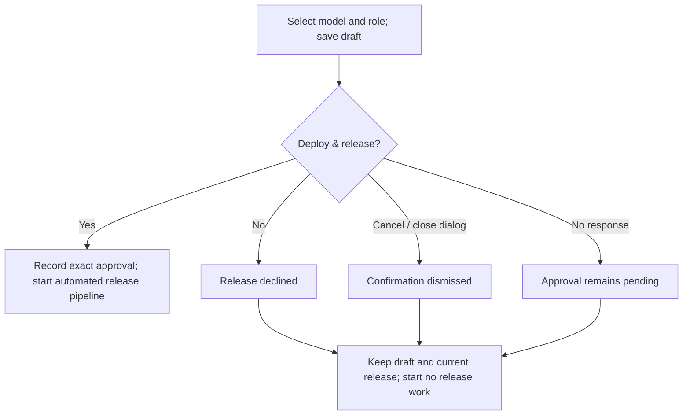
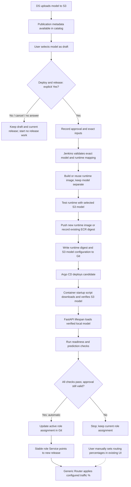

# NCM MLOps Implementation Plan

## 1. Goal

The NCM deployment flow starts when the Data Science team uploads a completed model to S3.

Uploading a model does **not** automatically build, deploy, or release it. The upload only makes the model available for selection.

The Board member or authorized delegate must explicitly approve the selected version in the UI **before any release processing starts**. In this plan, "user" means that authorized decision-maker.

The intended user flow is:

```text
Select model version
    |
    v
Confirm Deploy & release = Yes
    |
    v
Automatically build or reuse the runtime image, test, and deploy the approved version
    |
    v
Automatically validate and activate it after all checks pass
```

**No, cancel, or no answer means no release job starts.** Selection only saves a draft. There is no build, artifact download, validation job, deployment, or other background release work before explicit **Yes**.

That single approval authorizes the complete operation. There is no second approval after deployment. Existing production services and monitoring continue running throughout.

Model training is outside the scope of this plan.

The Docker image must contain only the prediction runtime, inference code, and required dependencies. Model artifacts remain separate in S3 and must not be included in the image.

Each serving release pairs an exact runtime image digest with an immutable S3 model location, artifact checksums, and deployment configuration. A container startup script downloads and verifies the selected model before starting the API server. The FastAPI application's lifespan hook then loads the verified local model before the Pod becomes Ready.

The MLOps platform should automate the technical steps. Users should trigger the process through the UI rather than asking engineers to manually update deployment files for each release.

---

## 2. Main Principles

### 2.1 Put explicit approval before all release processing

Selection is a draft action. Runtime image build or reuse, deployment, validation, and activation are automated stages of one approved operation.

The approval flow below shows what happens when the user responds to the **Deploy & release** confirmation or leaves it unanswered:


```mermaid
flowchart TD
    Draft["Select model and role; save draft"] --> Confirm{"Deploy & release?"}
    Confirm -->|"Yes"| Approved["Record exact approval; start automated release pipeline"]
    Confirm -->|"No"| Declined["Release declined"]
    Confirm -->|"Cancel / close dialog"| Dismissed["Confirmation dismissed"]
    Confirm -->|"No response"| Pending["Approval remains pending"]
    Declined --> Hold["Keep draft and current release; start no release work"]
    Dismissed --> Hold
    Pending --> Hold
```

**No response** means the user has not answered the confirmation; waiting never counts as approval. The user can return to the draft and explicitly approve it later. Canceling here means dismissing the confirmation before Yes; canceling an operation already started after Yes is covered in section 7. Section 3 shows the automated pipeline that follows Yes.

| Action | Trigger | Result | Can it receive application traffic? |
|---|---|---|---|
| Publish | DS completes the S3 upload | Model is available to list in the catalog; no release job | No |
| Select / save draft | User chooses a model version and role | Draft selection is saved; no release job | No |
| Leave release unapproved | User chooses No, cancels/closes the dialog, or gives no response | Remain in draft; no release work starts | No |
| Approve | User confirms **Deploy & release = Yes** | Backend records the exact approved request and starts the pipeline | No |
| Prepare, deploy, and validate | Approved pipeline runs automatically | Jenkins runs the selected image with the selected model and compares prediction API outputs with fixed reference results; an isolated candidate is then deployed and checked (section 5, steps 4 and 8) | No |
| Activate | Candidate passes all checks and the approval is still valid | Automation switches the selected role Service | Yes, according to existing routing settings |
| Set traffic | User changes Generic Router percentages | Router applies the selected distribution | Only released models receive traffic |

Changing the draft selection must not start Jenkins, download model artifacts, run validation jobs, build images, write deployment changes to Git, or create Kubernetes resources.

For example, if the user selects `3.5`, then changes the draft to `3.6`, neither version is prepared until the user explicitly approves **Yes** for `3.6`.

For example, the **Deploy & release** confirmation asks: "Deploy and release Challenger 3.6 in this environment?" The responses follow the approval flow above.

Approval defaults to **No** and must never be inherited by a different model, code revision, environment, or role. There must be no separate button that starts preparation before this approval.

---

### 2.2 Keep the runtime image and model artifacts separate

The current runtime downloads the model from S3 when FastAPI starts. In the target design, separate artifact preparation from application initialization.

For the initial implementation, move the existing download/retry logic into a container startup script (entrypoint). It retrieves and verifies the approved artifacts, then starts the API server only after preparation succeeds. Defer `initContainer`; the entrypoint provides this separation without adding another container.

FastAPI supports application initialization through its [lifespan hook](https://fastapi.tiangolo.com/advanced/events/), including loading a model into memory. Downloading artifacts there is technically possible, but it is not required by FastAPI. This plan assigns S3 retrieval, retries, and artifact verification to the startup script; the application loads the prepared local model and serves predictions. This also avoids repeating downloads for each API worker's lifespan initialization.

Store the runtime and model separately:

| Location | Contents |
|---|---|
| Docker image / ECR | FastAPI prediction runtime, inference code, and locked dependencies |
| S3 | Model artifact, model metadata, and golden sample |
| Release configuration / Git | Runtime image digest, exact S3 model location, artifact checksums, feature contract, and serving release identity |

Do not copy model files, model metadata, or golden samples into the Docker build context or image layers. Jenkins may download them separately for validation after approval.

Compatibility still needs to be checked because a new model may require changes in:

- feature retrieval;
- preprocessing;
- feature ordering;
- prediction logic;
- dependency versions.

A model version by itself does not fully describe the serving behavior.

The model and inference code must therefore be recorded and tested as one serving release while remaining separate artifacts. The release definition binds the selected S3 model to a compatible runtime image.

| Area | Current approach | Target approach |
|---|---|---|
| ECR image | Prediction runtime only | Prediction runtime + inference code + locked dependencies; no model artifacts |
| Model retrieval | Runtime downloads from S3 during FastAPI startup | Container startup script downloads with retries from the approved immutable S3 location and verifies identity/checksums before starting the API server |
| FastAPI startup | Download, retry, then load | Application lifespan hook loads the verified local model before Ready |
| Rollback unit | Runtime + model configuration | Previous tested runtime image digest + exact S3 model identity/checksums + recorded configuration |

S3 remains the source of model artifacts for validation and runtime startup. Retain the exact files for every active release and for the rollback retention period.

Example:

```text
s3://fcp-model-artifacts/serving/new_customers/2.5.0/
  model.cbm
  model_meta.json
  golden_sample.json
```

Each serving release must record the exact model/code combination.

Example:

```text
Serving release: ncm-3-5-r1

Model version: 3.5
Model location: immutable S3 path
Artifact checksums: recorded

Inference code: <exact-git-commit>
Dependencies: locked
Base image: pinned
Feature contract: recorded

Runtime image (no model files):
<ecr>/ncm-runtime@sha256:<image-digest>

Release configuration binds this image to the S3 model above.
```

If the model changes, create a new serving release. Reuse the compatible runtime image when its code, dependencies, pinned base image, and build configuration are unchanged; a model-only change does not require an image rebuild.

If the inference code or runtime build inputs change, create a new runtime image and serving release.

Example:

```text
ncm-3-5-r1
ncm-3-5-r2
```

Do not overwrite an existing release.

An image may be reused when the exact code commit, dependency set, pinned base image, and build configuration were already built and tested successfully and are compatible with the selected model. Each new model/image combination must pass compatibility and prediction checks, even when the image is reused.

Kubernetes should deploy the image by digest rather than by a mutable tag.

Deployment configuration supplies the serving release ID, exact model version, S3 bucket/key or immutable prefix, and expected artifact checksums. The container startup script downloads the selected files into a runtime directory such as:

```text
/opt/ncm/model/model.cbm
```

This directory is populated at container startup and is not part of the Docker image. The startup script verifies required files, model identity, and checksums before starting the API server. It must complete before API workers start, and the application must treat the prepared files as read-only. The application's lifespan hook loads the model from this directory. Use the configured model for the Pod's lifetime; changing models creates a new candidate release.

If download retries are exhausted, files are missing, or identity or checksum verification fails, the startup script exits with an error without starting the API server. If the model cannot be loaded, application startup fails. In either case, the Pod must not become Ready. Do not substitute another model or an unverified cached copy.

Each new or restarted Pod needs S3 read access to its configured artifact location. Provide access through the deployment's workload identity; keep credentials outside the image. Existing healthy Pods continue serving their loaded model while a candidate downloads and validates its model.

---

### 2.3 Use Git as the deployment source of truth

Git should store the desired deployment state.

This includes:

- candidate serving releases;
- ECR runtime image digests;
- exact S3 model locations, versions, and artifact checksums;
- inference configuration;
- active Champion and Challenger assignments.

Draft selections should be stored separately in the UI/backend database.

Selecting a draft must not change Git or trigger Argo CD.

| User action | Git change | Argo CD result |
|---|---|---|
| Select / save draft | None | No deployment change |
| No / cancel / no answer | None | No deployment change |
| Yes, then runtime image build/reuse and model/runtime tests pass | Pipeline writes candidate release to Git | Candidate Deployment is created |
| Same approved operation passes deployed-candidate checks | Pipeline updates active role assignment in Git | Role Service switches to the approved candidate |

One approved operation produces two automated Git changes:

```text
Deploy & release = Yes
    ↓
Jenkins
    ↓
Candidate Git commit
    ↓
Argo CD
    ↓
Candidate Deployment
    ↓
Candidate validation passes
    ↓
Assignment Git commit (automatic under the same approval)
    ↓
Argo CD
    ↓
Role Service update
```

These Git changes should be automated.

Git holds Helm values and templates; Helm renders Kubernetes manifests, and Argo CD reconciles them into Kubernetes. A YAML file's role depends on its location and contents: values configure the chart, templates generate resources, and rendered manifests describe Deployments and Services.

The MLOps engineer should configure the pipeline, repository permissions, Helm templates, and Argo CD integration once. Normal releases should not require manual YAML edits.

If repository policy requires a human review of each generated commit, that is an additional manual gate and must be documented separately; it is not assumed in this target flow.

---

### 2.4 Keep Champion and Challenger endpoints stable

The existing Kubernetes Service names should remain unchanged.

Example:

```text
http://new-customers-model.fcp-dev.svc.cluster.local
http://new-customers-model-challenger.fcp-dev.svc.cluster.local
```

These DNS names represent roles:

```text
new-customers-model             = Champion
new-customers-model-challenger  = Challenger
```

They do not represent a specific model version.

A candidate release should have its own Deployment and release labels.

Before approval, no candidate is prepared. After approval, the current Champion and Challenger Services continue to point to the currently released versions while the candidate is prepared, deployed, and checked.

The candidate may receive internal synthetic validation requests, but it must not receive normal application traffic.

After all candidate checks pass, automation updates the Service selector under the original approval. Selectors should use a unique serving-release ID, because a model version can have several inference-code revisions.

Example:

```text
Before release

new-customers-model-challenger
        |
        +--> serving-release=ncm-3-4-r1
```

```text
After release

new-customers-model-challenger
        |
        +--> serving-release=ncm-3-6-r1
```

The DNS name stays the same. Only the selected backend changes.

---

## 3. End-to-End Flow


```mermaid
flowchart TD
    S3["DS uploads model to S3"] --> Catalog["Publication metadata available in catalog"]
    Catalog --> Draft["User selects model as draft"]
    Draft --> Approve{"Deploy and release: explicit Yes?"}
    Approve -->|"No / cancel / no answer"| Hold["Keep draft and current release; start no release work"]
    Approve -->|"Yes"| Snapshot["Record approval and exact inputs"]
    Snapshot --> Jenkins["Jenkins validates exact model and runtime mapping"]
    Jenkins --> Image["Build or reuse runtime image; keep model separate"]
    Image --> Test["Test runtime with selected S3 model"]
    Test --> ECR["Push new runtime image or record existing ECR digest"]
    ECR --> Git["Write runtime digest and S3 model configuration to Git"]
    Git --> Deploy["Argo CD deploys candidate"]
    Deploy --> Prepare["Container startup script downloads and verifies S3 model"]
    Prepare --> Load["FastAPI lifespan loads verified local model"]
    Load --> Validate["Run readiness and prediction checks"]
    Validate --> Checks{"All checks pass; approval still valid?"}
    Checks -->|"Yes: automatic"| Assign["Update active role assignment in Git"]
    Checks -->|"No"| Stop["Stop; keep current role assignment"]
    Assign --> Live["Stable role Service points to new release"]
    Live --> Router["Generic Router applies configured traffic %"]
    Traffic["User manually sets routing percentages in existing UI"] -.-> Router
```

Any build or deployment failure also stops the operation before activation.

> **No explicit Yes means no release processing. Yes starts the full automated operation; successful checks allow activation without another approval.**

---

## 4. Publish and Select a Draft

After the DS upload is complete, the publication metadata can be listed in the catalog. The DS publishing script may register that metadata as part of publishing. This does not enqueue a release job.

The catalog entry should include:

- model family;
- model version;
- S3 location;
- artifact checksums;
- publication ID;
- compatible inference-code/build mapping and existing runtime image digest, when available.

If the inference-code mapping is missing, the model may appear in the catalog but must be marked incomplete.

**Deploy & release = Yes** must remain blocked until the mapping is available. Catalog display and draft persistence use metadata; they must not trigger artifact downloads or background preparation. Full compatibility and artifact verification happen only after approval.

Publishing a model must not:

- start Jenkins;
- download artifacts or run background validation;
- build an image;
- update deployment configuration;
- create Kubernetes resources;
- change the current release.

The UI should show the current released version separately from the draft.

Example:

```text
Current Challenger: 3.4
Draft Challenger:   3.5
```

If the user changes the draft to `3.6`, production remains on `3.4`.

Only the exact version and code combination captured when **Yes** is confirmed may be prepared.

---

## 5. Automated Execution After Yes

Only after the user confirms **Deploy & release = Yes**, the backend records the approval, creates a tracked operation, and enqueues Jenkins. There is no upload-triggered, draft-triggered, or speculative preparation pipeline.

The operation should record:

- environment;
- selected role;
- model version;
- artifact location;
- artifact checksums;
- inference-code Git commit;
- build definition revision;
- dependency lock and pinned base image;
- existing runtime image digest, if reused; otherwise record the resulting digest after the build;
- draft revision;
- operation ID;
- approver and approval timestamp;
- current role assignment and routing settings shown during approval.

The backend must enforce this gate for every start/retry API, not only in the UI. Duplicate clicks must return the same operation rather than start duplicate builds. A changed draft cannot replace an operation's captured inputs; a different target requires a new explicit Yes. Serialize operations for the same environment and role, and recheck the expected active assignment before switching it.

The approved pipeline then runs the following steps.

### Step 1 — Validate the release definition

Verify:

- model/code compatibility mapping;
- immutable artifact path;
- checksums;
- existing runtime image identity and compatibility, if reused;
- feature contract;
- dependency definition;
- build configuration.

If validation fails, stop the operation.

The currently released Champion and Challenger must remain unchanged.

### Step 2 — Fetch exact inputs

Jenkins:

- resolves the exact inference-code commit and build inputs, checking out the code if an image build is needed;
- downloads the exact model files from S3 into a separate validation workspace outside the Docker build context;
- verifies required files, model metadata, and checksums.

Retries must use the same captured inputs.

The pipeline must not silently replace the requested model, branch, dependency version, or base image with a newer one.

### Step 3 — Build or reuse the runtime image

The image must contain only:

- FastAPI prediction runtime;
- inference code;
- locked dependencies.

Keep model artifacts, model metadata, and golden samples in S3, outside the build context and all image layers. Supply model selection and serving release identity through deployment configuration.

If a compatible tested image already exists for the exact runtime build inputs, reuse its digest. A model-only change creates a new serving release without rebuilding that image.

### Step 4 — Test the runtime with the selected model

The **model/runtime pair** is the exact model artifact plus the exact runtime image containing the inference code and dependencies. Jenkins tests them together by starting that image in an isolated test environment and sending requests to its prediction API.

**Test inputs.** DS publishes `golden_sample.json` with the model: fixed prediction requests, any feature values needed to reproduce them, and expected prediction outputs. DS and the inference-code owner define the expected feature contract and numeric tolerances before release testing. The sample and tolerances must be versioned and covered by the release's artifact checksums. Expected results come from the reference inference implementation; the pipeline must not generate its expectations from the runtime under test. Keep these files in the separate validation workspace, outside the image.

**Execution.** Jenkins starts the image through its normal container startup script with the approved S3 location, checksums, and inference configuration. For a new build, test the exact local image ID and push that same image in step 5 without rebuilding it. For a reused image, pull and test its recorded ECR digest. A separate test runner calls the running API and performs these checks:

| Check | How it is tested | Pass condition |
|---|---|---|
| Startup and model identity | Start with a clean model directory, exercise S3 download and verification, and wait for readiness within a configured timeout. Compare the loaded model identity and verified checksums with the approved release. | The startup script verifies the exact artifacts; FastAPI loads the local model; readiness succeeds with the expected identity. |
| Prediction correctness | Send every golden request through the real API, preprocessing, feature ordering, model inference, and response serialization. Compare each output with its stored reference result. | Every required case passes: categorical outputs match exactly; numeric outputs are finite and within the recorded tolerance. A successful HTTP response alone is insufficient. |
| Feature and API contracts | Check feature names, types, ordering, and missing-value behavior against the model contract. Exercise valid and invalid requests and check response fields, types, and status codes against Generic Router expectations. | All contract checks pass, including documented handling of invalid or missing inputs. |
| Failure handling | In disposable test instances, inject download failures, missing/corrupt files, checksum mismatches, and model-load errors. Verify retry behavior and startup failure after retries are exhausted. | No instance serves predictions with an invalid or substitute model; unsuccessful initialization never becomes ready. Fault injection does not modify the approved S3 artifacts. |
| Image contents | Inspect the built image and its layers separately from the running container's downloaded files. | Model artifacts, model metadata, and golden samples are absent from the image and its build context. |

For repeatable golden tests, configure test feature services to return the fixed feature values from the sample. This exercises the runtime's feature client and inference path while keeping input data stable. The deployed-candidate checks in step 8 also verify connectivity and compatibility with the target environment's actual feature services.

For example, if a reference score is `0.8123` and its recorded absolute tolerance is `0.0001`, the test passes only when `abs(actual_score - 0.8123) <= 0.0001`. These numbers are illustrative; DS and the inference-code owner set tolerances appropriate to the model.

**Result and release gate.** Jenkins saves a report containing the tested image identity, model location/checksums, golden-sample checksum, inference-code and test-suite revisions, tolerances, per-case expected/actual results, and failure logs. Link the report to the operation and serving release; record the ECR digest from step 5 against the same tested image. Missing reference data, readiness timeout, or any failed required check stops the pipeline before candidate deployment. Reusing an image does not reuse another model's test result.

### Step 5 — Record the runtime image in ECR and the serving release

For a new build, push the tested runtime image to ECR. For a reused image, retain its existing digest. Record the serving release separately:

- runtime image digest;
- model version;
- immutable S3 artifact location and checksums;
- inference-code commit;
- build inputs;
- build/reuse result and model/runtime validation result;
- operation ID.

One runtime image may support several model versions. Each model/image pairing has its own serving release identity and validation record.

### Step 6 — Write candidate configuration to Git

Jenkins writes the candidate release to Git: runtime image digest, serving release ID, exact S3 model location/version, expected checksums, and inference configuration. Git contains model references and configuration; model files remain in S3.

This change must not modify the active Champion or Challenger assignment.

The candidate should have unique release labels so that multiple releases of the same model version cannot accidentally share production traffic.

### Step 7 — Deploy the candidate

Argo CD detects the Git change and creates the candidate Deployment.

Kubernetes pulls the exact ECR runtime image digest and supplies the candidate's model configuration and S3 read access.

The container startup script downloads the model from the configured S3 location with retries and verifies the files, checksums, and expected identity. Only after verification succeeds does it start the API server. The FastAPI application's lifespan hook loads the verified local model. The Pod stays unready until this completes successfully.

### Step 8 — Validate the deployed candidate

The pipeline's test runner sends internal synthetic requests directly to the isolated candidate endpoint, without switching the stable Champion or Challenger Service. It checks the deployed image/model identity and runs prediction and feature-service integration checks against the target environment. For reference-score comparisons, use controlled test records with known feature values; changing live customer data is not a repeatable golden test.

Verify:

- Pods are Ready;
- expected image digest is running;
- expected model version is loaded;
- downloaded model identity and checksums match the candidate configuration;
- expected inference-code version is running;
- prediction API and reference-output checks pass;
- required feature services are reachable and return the fields/types required by the model;
- required capacity is available.

Save these results alongside the step 4 report. A failed check, timeout, or required feature missing from the target environment prevents activation.

If all checks pass, the candidate is technically ready. The backend rechecks the original approval and captured inputs, then automatically continues to activation:

```text
Validating -> Activating -> Released
```

Readiness is an internal checkpoint, not a waiting state for a second user approval. Until the assignment update in section 7, the candidate remains isolated from live and mirrored application traffic.

---

## 6. UI States

The UI should use clear lifecycle states.

| State | Meaning | Next action |
|---|---|---|
| Published | Model is registered in the catalog | Select |
| Draft / awaiting approval | User selected the model; no release work has started | Review and explicitly confirm Yes, or remain in draft |
| Approved / queued | Yes is recorded for exact inputs | Pipeline starts automatically |
| Preparing | Approved runtime image build/reuse, model/runtime tests, and deployment are running | Wait or inspect failure |
| Validating | Automated checks run against the isolated candidate | Automatically activate if checks and approval remain valid |
| Activating | Role assignment is being applied under the original approval | Wait for verification |
| Released | Candidate is active behind the role Service | Monitor / adjust traffic |
| Failed | Preparation or release failed | Review and retry |

The UI should show separately:

- current released version;
- current draft version;
- approved operation's exact target and serving release identity;
- operation status.

A successful build alone is insufficient: deployment, readiness, prediction checks, and approval verification must all pass. After they pass, activation is automatic within the approved operation.

Selecting No or closing the confirmation leaves the model in draft. The only approval comes before the pipeline starts.

---

## 7. Upfront Approval and Automatic Activation

Before any release job starts, the UI should show:

- target environment;
- selected role;
- selected model version, artifact identity, and exact inference-code revision;
- current released version;
- current routing percentage;
- current live/shadow routing state.

The user must explicitly confirm:

```text
Deploy & release = Yes
```

The confirmation must explain that Yes starts runtime image build or reuse, testing, and deployment and authorizes activation after successful checks. If the role currently has traffic, the approved model will inherit that traffic share when activated. The user can adjust routing separately before approving if required.

No, cancel, or no answer starts nothing. The current release stays active. Approval is never inferred from saving a selection, an S3 event, a Slack message, or an existing approval for a different revision.

After the approved pipeline in section 5 passes all checks, the backend should automatically:

1. verify the candidate is still healthy and its prediction checks passed;
2. confirm that the original approval is valid for the exact prepared release and the expected role assignment has not changed;
3. update the role assignment in Git;
4. wait for Argo CD reconciliation;
5. verify the Kubernetes Service selector;
6. verify the selected backend Pods are Ready;
7. verify the expected model is actually serving;
8. mark the operation Released only after observed state matches desired state.

The audit record should include:

- actor;
- release ID;
- previous release;
- target role;
- approval timestamp and approved inputs;
- candidate and assignment Git revisions;
- timestamp;
- result.

### Existing traffic must be preserved

Release changes the model behind the role endpoint.

It does not automatically change Generic Router percentages.

Example:

```text
Before release

Challenger -> 3.4
Traffic    -> 10%
```

After releasing `3.6`:

```text
Challenger -> 3.6
Traffic    -> 10%
```

If Challenger traffic is `0%`, the Service can switch to the new release while live traffic remains `0%`.

Selecting No or canceling before approval requires no rollback because no release work has started. Canceling an operation after Yes is a separate action: automation must stop safely and reconcile any Git changes already made. It must not claim that already-applied changes were undone merely because a job was canceled.

---

## 8. Routing Percentage Is a Separate Control

The existing Generic Router UI should continue to control traffic.

Example:

```text
Champion   90%
Challenger 10%
```

Changing traffic percentage must not:

- build a new image;
- deploy a candidate;
- change the draft selection;
- release a model.

The release workflow must also not modify traffic percentages automatically.

This keeps two responsibilities separate:

```text
Model release
    = Which model is behind Champion / Challenger?

Routing policy
    = How much traffic goes to Champion / Challenger?
```

Before activation, the candidate must receive no normal live or mirrored application traffic.

Internal synthetic validation traffic is allowed only during the approved pipeline. Approval is required even if the selected role currently has 0% traffic.

---

## 9. Failure Handling, Promotion, and Rollback

### Failure handling

If any preparation step fails, active role assignments must stay unchanged.

Examples:

- validation failure;
- S3 download failure;
- model identity or checksum mismatch;
- image build failure;
- ECR push/pull failure;
- local model-load failure;
- readiness failure;
- prediction validation failure.

The UI should show:

- failed stage;
- failure reason;
- operation ID;
- retry option.

If a failure happens during activation after the Git assignment has already changed, the UI should show both:

```text
Desired assignment
Observed assignment
```

The platform must verify actual state instead of assuming that the change either fully succeeded or fully failed.

Retries must remain within the original approved inputs. A different model, code revision, environment, or role requires a fresh Yes. Repeated requests must not create competing operations or allow a stale operation to overwrite a newer assignment.

---

### Promotion

Promotion uses the same standard release process.

Example:

```text
Champion   -> 3.4
Challenger -> 3.6
```

To promote `3.6`:

1. select `3.6` for Champion;
2. explicitly confirm **Deploy & release = Yes** for Champion;
3. only then reuse the tested runtime image and exact S3 model configuration, creating the candidate Deployment if required;
4. automatically activate it after checks pass under that approval;
5. verify the Champion Service;
6. keep routing changes as a separate user decision.

Promotion should not happen automatically based only on monitoring results.

---

### Rollback

Rollback also uses the normal release mechanism.

Select the previous release and explicitly confirm Yes before rollback processing starts. An existing image or Deployment does not bypass approval.

Use the previous tested runtime image digest together with its exact S3 model location, artifact checksums, and recorded configuration. Any new or restarted rollback Pod downloads and verifies that same model before becoming Ready.

Do not rebuild an old release from the current Git branch.

Keep previous runtime images, S3 model files, and release configurations available for a defined rollback period. Restoring the image digest alone does not identify the model to serve.

Do not remove a runtime image, S3 artifact, release configuration, or Deployment while any release that uses it is:

- actively assigned;
- being prepared;
- being released;
- draining;
- retained for rollback.

Because Service updates are asynchronous, old Pods may continue handling existing connections for a short period.

Verify the new assignment before removing previous capacity.

---

## 10. Example: Challenger 3.4 → 3.5 → 3.6

| Action | Result | Active Challenger |
|---|---|---|
| DS uploads `3.5` and `3.6` | Both appear in the catalog | `3.4` |
| User selects `3.5` | Draft only | `3.4` |
| User changes draft to `3.6` | Draft changes only | `3.4` |
| User selects No, cancels, or does nothing | No background release processing starts | `3.4` |
| User explicitly confirms Deploy & release = Yes for `3.6` | Approval is recorded; only `3.6` starts preparation | `3.4` |
| Pipeline builds or reuses the runtime image, tests it with model `3.6`, and deploys the candidate | Startup script downloads and verifies `3.6`; FastAPI loads it locally; isolated candidate is checked automatically | `3.4` |
| All checks pass and approval is still valid | Automation switches the Challenger Service; no second approval | `3.6` |

This example shows the main behavior:

> **Before Yes: draft only, no preparation. After Yes: build or reuse the runtime image, test, deploy, validate, and activate automatically.**

---

## 11. Component Responsibilities

| Component | Responsibility |
|---|---|
| DS publisher / S3 | Store immutable model artifacts, metadata, checksums, and golden samples with fixed inputs and reference outputs; agree numeric tolerances with the inference-code owner |
| Inference-code owner | Maintain versioned inference/feature logic, compatibility mapping, and API/feature-contract tests; agree reference cases and tolerances with DS |
| Model UI / backend | Manage drafts, enforce upfront Yes, capture approved inputs, track operations, automate activation, and audit |
| Jenkins | Run only after approval: validate separate model artifacts, build/reuse runtime image, test the pairing, push new images to ECR, and write candidate configuration |
| ECR | Store immutable tested runtime images containing inference code and dependencies only |
| Git / Helm | Store runtime image digests, S3 model references/checksums, candidate configuration, and active role assignments |
| Argo CD | Reconcile Git state into Kubernetes |
| Kubernetes | Run candidate/released Deployments and stable role Services |
| Container startup script | Download the configured S3 model with retries, verify identity/checksums, and start the API server only after successful preparation |
| FastAPI application | Load the verified local model in its lifespan hook and provide readiness/prediction endpoints |
| Generic Router | Control Champion/Challenger traffic distribution |
| Prometheus / Grafana | Monitor health, errors, latency, routing, and model identity |

---

## 12. Existing Components and New Work

### Existing components

The following pieces already exist:

- DS model upload to S3;
- FastAPI runtime with S3 model download;
- Generic Router traffic configuration;
- stable Champion and Challenger Service endpoints.

### New implementation work

The new design requires:

- model-to-inference-code mapping;
- serving release definition pairing a runtime image digest with an immutable S3 model and configuration;
- runtime-only image build/reuse with model artifacts excluded from the build context and image layers;
- container startup script reusing the existing S3 download/retry logic, verifying model identity/checksums, and starting the API server only on success;
- FastAPI lifespan initialization that loads the verified local model;
- versioned golden samples and a Jenkins test runner that checks each model/runtime pairing through the prediction API, compares reference outputs, and saves a release validation report;
- model catalog and draft-selection behavior;
- one **Deploy & release** UI/backend action with explicit Yes before any release processing;
- backend approval enforcement and automatic activation after successful checks;
- candidate deployment workflow;
- release operation tracking;
- retry and deduplication handling;
- audit history.

Jenkins, Git, Helm, and Argo CD integration should be verified before the full workflow is considered implemented.

---

## 13. First Release Plan

The first implementation should use one NCM candidate and prove the complete lifecycle.

### Phase 1

1. DS uploads one NCM model to S3.
2. The model is registered in the catalog.
3. The exact inference-code mapping is added.
4. User selects the model as a draft.
5. Verify that selecting No, closing the dialog, or waiting starts no background release work.
6. User reviews the exact target and explicitly confirms **Deploy & release = Yes**.
7. The backend records approval and starts Jenkins with the captured inputs.
8. Jenkins verifies the separate S3 artifacts and builds or reuses the compatible runtime image; no model files enter the image.
9. Jenkins tests the runtime with the selected S3 model, then pushes a new image or records the existing ECR digest.
10. Jenkins writes the runtime digest, exact S3 model location/checksums, and candidate configuration to Git.
11. Argo CD deploys the candidate; the container startup script downloads and verifies the configured S3 model, then FastAPI loads it locally through its lifespan hook.
12. Automated readiness and prediction checks pass.
13. The backend rechecks the original approval and automatically updates the role assignment in Git.
14. Argo CD updates the stable Service.
15. The platform verifies the actual serving version and marks it Released.
16. The existing Generic Router UI controls traffic percentages as a separate human decision.
17. The team monitors the release.
18. Promotion or rollback requires a new upfront Yes for that operation.

This first phase should prove the main lifecycle before adding more advanced automation.

---

## 14. First-Release Acceptance Criteria

The first implementation is complete when:

1. Uploading or cataloging a model starts no background release work.
2. Selecting or changing a draft starts no Jenkins job, artifact download, validation job, image build, deployment Git change, or Kubernetes change.
3. No, cancel, and no answer leave the current release unchanged and enqueue nothing.
4. Jenkins uses the exact model, code commit, dependencies, and build definition.
5. The ECR image contains only prediction runtime, inference code, and dependencies. Model artifacts, model metadata, and golden samples are absent from its build context and image layers.
6. The container startup script downloads the exact model from its configured immutable S3 location with retries and verifies model identity/checksums before starting the API server. The FastAPI application's lifespan hook loads the verified local model without downloading artifacts. New or restarted Pods have the required S3 read access.
7. Failed downloads, missing or invalid files, or identity/checksum mismatches prevent the API server from starting. Model-load failures prevent application startup. All keep the Pod unready and prevent activation.
8. A candidate can be created even when no Deployment for that model version already exists.
9. Only explicit **Yes** starts processing; direct backend calls and retries cannot bypass approval.
10. Approval defaults to **No** and is bound to the exact reviewed model, code, environment, role, and draft revision.
11. After Yes, runtime image build/reuse, testing, deployment, validation, and activation run automatically; there is no second approval after readiness. Candidates receive no application traffic until activation, and failed checks prevent the role switch.
12. Release keeps the same stable Champion/Challenger DNS names.
13. Release does not change Generic Router percentages.
14. Model or inference-code changes create a new serving release identity. A compatible model-only release reuses the runtime image without rebuilding it and passes tests for the new pairing.
15. Rollback uses the previous tested runtime image digest, exact S3 model location/checksums, and saved configuration. Referenced images and S3 artifacts remain available for active releases and rollback retention.
16. Draft edits cannot replace approved inputs; duplicate or stale operations cannot activate an unintended release.
17. Approval is required before processing even when an image already exists or the role has 0% traffic.
18. Each model/runtime pairing has a passing report tied to the exact image, model checksums, golden sample, and test-suite revision. Required prediction, contract, startup, and failure checks pass before candidate deployment; deployed prediction and feature-service checks pass before activation.

---

## 15. Target Operating Model

```text
DS publishes model
        ↓
Model appears in catalog
        ↓
User selects draft
        ↓
User explicitly confirms Deploy & release = Yes
        ↓
Backend records exact approval and starts the pipeline
        ↓
Jenkins builds or reuses runtime image; tests it with the separate S3 model
        ↓
New runtime image is pushed to ECR, or existing digest is reused
        ↓
Git records runtime digest + S3 model configuration; Argo CD deploys candidate
        ↓
Container startup script downloads and verifies the configured S3 model
        ↓
FastAPI lifespan loads the verified local model
        ↓
Candidate passes automated validation
        ↓
Stable role Service automatically switches to approved release
        ↓
Generic Router keeps the configured traffic %
        ↓
Monitor
        ↓
Promote or rollback through the same process
```

Main principle:

> **Without explicit Yes, no release processing starts. With Yes, the system builds or reuses the runtime image, tests it with the separate S3 model, deploys, validates, and activates the exact approved release.**

The platform automates the technical execution.

The user remains responsible for:

- model selection;
- explicit Yes before any release processing;
- traffic percentage;
- promotion;
- rollback.
