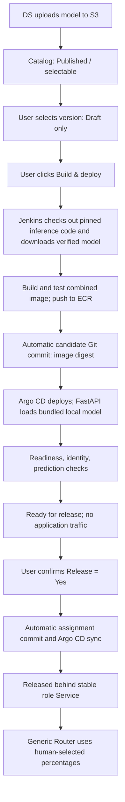

# NCM MLOps Implementation Plan

## 1. Goal

Start with DS uploading a completed model to S3. The platform makes it selectable, but waits for explicit UI actions before preparing or releasing it. Model training is outside scope. Each requested serving release packages the model artifact together with its exact compatible inference code and dependencies in one ECR image.

**Select a draft -> click Build & deploy -> wait for Ready for release -> explicitly approve Release.**

This replaces the earlier upload-triggered deployment flow. Changing the selected version several times must not build or deploy every intermediate choice. The MLOps engineer implements the automation; users initiate it through the UI instead of requesting a manual infrastructure-repository edit for each release.

## 2. Main principles

### 2.1 Separate selection, build, deployment, and release

| Action | Trigger | Result | Can the new version receive application traffic? |
|---|---|---|---|
| Publish | DS completes the S3 upload | Version appears in the catalog | No |
| Select / save draft | User chooses a model version and role | Saved draft only; no build, deployment, or active assignment change | No |
| Build | User clicks **Build & deploy** | Jenkins packages the selected model with its pinned inference code, tests the image, and pushes it to ECR | No |
| Deploy | Successful combined-image build or reuse of the exact existing image | Argo CD deploys that image digest; validation runs | No; synthetic validation requests only |
| Release | User separately confirms **Release = Yes** for the ready candidate | Backend activates that exact release behind the selected role Service | Yes, according to the role's current routing policy |
| Set traffic percentage | User changes the existing Generic Router configuration | Router applies the chosen traffic distribution | Only already-released versions are reachable through role endpoints |

**Build & deploy** is one explicit UI request with two automated stages. **Release** is a separate action. Release approval defaults to **No** and must not be carried over from a previous selection or release.

### 2.2 Package inference code and model artifact together

The current approach builds a prediction-runtime image and downloads the model from S3 inside FastAPI. **The revised target builds a serving image containing both the model artifact and its compatible inference code.** This replaces the earlier runtime-only image assumption for new releases.

A new feature can require different feature retrieval, preprocessing, feature ordering, or prediction logic. Pinning the model version alone does not identify that code. Package and test the code/model combination as one release; packaging alone does not prove compatibility.

| Concern | Current approach | Revised target |
|---|---|---|
| ECR image | Prediction runtime | Exact inference code, locked dependencies, and model artifact |
| Model retrieval | FastAPI downloads from S3 at startup | Jenkins downloads and verifies the artifact before building the image |
| FastAPI startup | Download, retry, then load | Load the bundled local model and check its identity |
| Rollback unit | Runtime and model configuration | Previous tested image digest plus its recorded deployment configuration |

S3 remains the original artifact store:

```text
s3://fcp-model-artifacts/serving/new_customers/2.5.0/
  model.cbm
  model_meta.json
  golden_sample.json
```

The artifact producer/runtime owner must supply a release definition mapping the model artifact to an inference-code Git commit, dependency lockfile, pinned base image, and feature/input contract. Store this mapping in controlled release metadata; do not assume the current `model_meta.json` already contains it. One code revision may support several models, but each release must name its exact tested combination.

```text
Serving release: ncm-3-5-r1
  Model: 3.5, immutable S3 location + file checksums
  Inference code: <exact-git-commit>
  Build inputs: pinned base image + dependency lockfile + feature contract
  Output: <ecr>/ncm-serving@sha256:<image-digest>
```

A changed model or inference-code revision requires a new serving image/release. If code changes for model `3.5`, create a new release such as `ncm-3-5-r2`; do not overwrite `r1`. Reuse an image only when the exact recorded code/model/build inputs already have a successful tested build. Shared Docker layers may be reused, but a runtime-only image is not the final deployable release.

Configure Kubernetes to use the recorded image digest, not a mutable tag. See [Kubernetes image identities](https://kubernetes.io/docs/concepts/containers/images/). Keep inference-affecting configuration in the release record; environment credentials stay outside the image.

**Runtime change required:** implement FastAPI local loading from a fixed bundled path, for example `/opt/ncm/model/model.cbm`. Disable startup S3 download/fallback for these releases and fail readiness if the bundle is missing, mismatched, or unloadable. Existing deployed versions may continue using their current downloader during migration. An `initContainer` is still unnecessary.

This adds image storage and build/push work per new combination, but makes the selected code/model pairing explicit and removes S3 model-download dependency from candidate startup. Nodes still need access to ECR when the image is not cached. Builds occur only after **Build & deploy**, and release still requires separate approval.

### 2.3 Use Git for deployment and active assignments

Git stores desired deployed releases, their ECR image digests and inference configuration, and active role assignments. Draft UI selections are stored separately in the assignment backend's database and do not change Argo CD's desired state.

| User action | Automated Git change | What Argo CD applies |
|---|---|---|
| Select / save a draft | None | Nothing |
| Click Build & deploy | Jenkins records the tested combined-image digest and exact candidate release | Candidate Deployment and internal validation access; existing role selectors remain unchanged |
| Confirm Release = Yes | Release backend updates the chosen role's active assignment | Existing role Service selects the approved candidate |

```text
Build & deploy click -> Jenkins -> candidate configuration commit -> Argo CD
Release = Yes       -> release backend -> assignment commit -> Argo CD
```

**Jenkins/the backend creates configuration commits automatically.** The MLOps engineer does not manually edit YAML for each UI request. Configure the Git service account, chart templates, allowed repository workflow, and Argo CD Application once, then maintain that integration.

Argo CD auto-sync can stay enabled: the approval gates are enforced before candidate/assignment changes are written to its tracked Git branch. Required repository reviews still apply and count as additional manual work. See [Argo CD automated sync](https://argo-cd.readthedocs.io/en/stable/user-guide/auto_sync/).

### 2.4 Preserve stable role endpoints

Keep the existing Champion and Challenger Service names, for example:

```text
http://new-customers-model.fcp-dev.svc.cluster.local
http://new-customers-model-challenger.fcp-dev.svc.cluster.local
```

A candidate uses its own Deployment and distinct release labels. Existing role Services, production ingress, and shadow routes must continue selecting the currently released version until Release is approved. Internal candidate validation access is permitted for synthetic checks.

At release, automation changes the chosen role Service selector. Kubernetes maintains the matching endpoints; callers retain their existing DNS names. See [Kubernetes Services](https://kubernetes.io/docs/concepts/services-networking/service/).

## 3. End-to-end flow



## 4. Publish and select a draft

After all three files upload successfully, the publishing process registers model version, S3 location, source checksums, and publication ID in the catalog. Link the model to its versioned inference-code/build definition. If that mapping is missing, show it as incomplete and block Build & deploy until the artifact producer/runtime owner supplies it; do not guess a compatible code revision. This can run lightweight metadata/completeness checks. It must not start image builds, commit candidate deployment configuration, or create Kubernetes resources.

The earlier publisher-to-Jenkins deployment trigger must therefore be removed or limited to catalog registration. A Slack notification may inform the team; neither uploading nor notifying grants deployment/release approval.

The UI shows the **currently released version** separately from the **draft selected version**. A user can select a published version even if no Kubernetes Deployment exists yet.

Example: Challenger remains on `3.4` while the user changes the draft from `3.5` to `3.6`. Neither draft change starts processing. Only the version requested through **Build & deploy** is prepared.

## 5. Build & deploy: explicitly requested, automatically executed

When the user clicks **Build & deploy**, the backend captures the environment, model/artifact identity, inference-code commit, build-definition revision, and draft revision. It starts a tracked operation and triggers Jenkins. The UI should show a serving release revision as well as the model version when more than one code/model combination exists.

1. **Resolve and validate inputs:** verify the model/code mapping, immutable artifact location, source checksums, feature contract, and dependency/build definition.
2. **Fetch the exact inputs:** check out the pinned inference-code commit and download the S3 bundle into the Jenkins workspace. Verify every required file before including it in the Docker build context. Retry transient fetch failures within a defined timeout.
3. **Build the combined image:** package inference code, locked dependencies, the model, metadata, and release identity. Include the golden sample as a test resource. Do not substitute the latest branch, model, or base image during a retry.
4. **Test the image:** start the packaged FastAPI application, confirm it loads the local bundle without an S3 model fetch, and run golden-sample predictions. Test feature names/types/order, transformations, feature-service integration where used, and the request/response contract expected by Generic Router. Required new features must exist in the target environment; bundling code cannot create missing upstream data.
5. **Push to ECR:** publish the tested image and record its digest and build provenance. If an identical tested build already exists, verify and reuse that exact image instead of rebuilding.
6. **Write candidate configuration:** Jenkins commits the serving release ID, image digest, and configuration to Git. Preserve all active role assignments. Use distinct release labels so two code revisions of the same model cannot accidentally share role traffic.
7. **Deploy and load:** Argo CD creates the candidate from the recorded digest. Kubernetes pulls the image; FastAPI loads its bundled local model. Create internal validation access when needed.
8. **Verify and report:** check capacity, model-aware readiness, actual model/code identity, and predictions in the target environment. Mark **Ready for release** only on success; wait for separate release approval before application traffic.

Jenkins uses scoped credentials to fetch S3 artifacts and push to ECR. Keep credentials and unrelated workspace files out of the image/build context. If authentication is needed inside a Docker build step, use a secret mount rather than baking credentials into build arguments or image environment variables; see [Docker build secrets](https://docs.docker.com/build/building/secrets/).

Use an operation ID and durable deduplication so retries/double-clicks do not create duplicate builds or conflicting Git changes. Reuse results only for the same artifact, code commit, build inputs, and inference configuration.

If the draft changes while preparation is running, the job remains bound to its original captured revision; do not silently switch its inputs. Show the changed draft as unprepared unless that exact release already exists and passes validation. Superseded work can be cancelled where possible or retained for cleanup, but must never auto-release.

## 6. Ready does not mean released

| UI state | Meaning | Next action |
|---|---|---|
| Published | Artifact registered with its code/build mapping, or visibly awaiting that mapping | Select a draft; resolve missing mapping before preparation |
| Draft | Proposed role/version saved | Build & deploy |
| Preparing | Requested validation/build/deployment is running | Wait or inspect failure |
| Ready for release | Exact candidate deployed and verified; active assignment unchanged | Explicitly approve Release |
| Releasing | Approved assignment is being reconciled and checked | Wait for observed verification |
| Released | Active assignment matches the approved release | Monitor or adjust routing percentages |
| Failed | Preparation or activation failed | Inspect result and retry/recover explicitly |

Display operation progress, draft version, prepared release, and currently released version separately. A healthy Deployment or successful Jenkins job must not automatically toggle Release to Yes. Enforce these rules in the backend, not only by disabling UI buttons.

## 7. Release: explicit approval before traffic

The user reviews the environment, role, exact prepared version, current active version, and current live/shadow routing policy, then explicitly confirms **Release = Yes**.

1. Authenticate the decision and recheck that the requested candidate is Ready for release.
2. Bind approval to that exact artifact/image/configuration and draft revision. Reject stale requests if the selection, current assignment, or approved configuration has changed.
3. Commit the role-assignment update through the backend. This is a separate Git change from candidate deployment.
4. Wait for Argo CD reconciliation; verify the Service selector, ready backends, and actual serving version.
5. Mark Released only when observed state matches the approved assignment. Record actor, release identity, previous version, Git revision, time, and result.

**Traffic consequence:** if Challenger already receives 10%, releasing `3.5` replaces `3.4` behind that endpoint and makes `3.5` eligible for that existing 10%. The release confirmation must show this. Release does not automatically reset or increase percentages. At 0% live traffic, release activates the endpoint but live traffic remains 0%; existing shadow traffic is also part of the confirmation.

If the user selects No, cancels before submission, or does nothing, the currently released version continues serving. A selection change invalidates any unsubmitted approval. Cancelling after an assignment commit has been submitted needs an explicit tracked recovery/change; closing the UI does not undo Git desired state.

## 8. Routing percentages remain a separate manual control

Use the existing Generic Router UI to choose distributions such as Champion 90% / Challenger 10%. This changes routing policy without building or deploying a model.

The model selection/build/release UI must not change those percentages on its own. Before release, a candidate must receive neither live nor mirrored application traffic, regardless of the percentages currently configured for the role. Synthetic validation is separate.

## 9. Failure handling, promotion, and rollback

A validation, build-time artifact download, image push/pull, local model-load, or readiness failure leaves active assignments unchanged. Surface the failed stage and reason; allow an explicit retry. If release fails, show desired and observed assignments separately rather than assuming no change happened.

Promotion and rollback use the same controls: select the target version, prepare it if needed, then explicitly release it for the chosen role. Reuse a retained healthy deployment where possible, or deploy the previously tested combined-image digest with its recorded configuration; do not rebuild rollback code from the current branch. Do not automatically promote based on metrics or release an older/newer draft after a job completes.

Keep previous releases and their ECR images available for a rollback/drain window. Image-retention policies must preserve digests still assigned, pending, or retained for rollback. Service changes propagate asynchronously, and existing connections may still reach old Pods during transition. Verify the new version and drain before removing previous capacity. Two role changes are separate operations, not an atomic swap.

Monitor request/error counts, latency, actual model identity, routing distribution, score distribution, and runtime health. Alerts inform a human decision. Cleanup removes only unassigned releases outside retention, excluding pending preparation/release operations.

## 10. Example: Challenger 3.4 -> 3.5 -> 3.6

| User/system action | Build/deployment result | Active Challenger |
|---|---|---|
| DS uploads `3.5` and `3.6` | Catalog entries only | `3.4` |
| User selects `3.5` | Draft saved; no build/deploy | `3.4` |
| User changes the draft to `3.6` | Draft updated; no build/deploy | `3.4` |
| User clicks Build & deploy for `3.6` | Build/test/push only the selected `3.6` code/model image and deploy it; `3.5` is skipped | `3.4` |
| `3.6` passes validation | Ready for release; no application traffic to `3.6` | `3.4` |
| User confirms Release = Yes for `3.6` | Backend commits and verifies activation | `3.6` after successful reconciliation |

## 11. Responsibilities and remaining implementation

| Component | Responsibility |
|---|---|
| DS publisher / S3 | Complete immutable artifacts, checksums, metadata, and sample acceptance criteria; catalog registration without automatic deployment |
| Inference-code owner | Supply versioned inference/feature logic and the code/model compatibility mapping; application-code development remains a prerequisite to packaging |
| Model UI / backend | Draft selection, Build & deploy action, separate Release approval, operation tracking, concurrency, and audit |
| Jenkins / ECR | On-request fetch, combined-image build/test/push, provenance, digest recording, and candidate Git commit |
| Git / Helm | Desired candidate deployments and active assignments as separate changes |
| Argo CD / Kubernetes | Reconcile requested candidates and approved role changes; preserve stable role endpoints |
| FastAPI | Implement local bundled-model loading, identity/readiness checks, and matching inference behavior |
| Generic Router UI | Existing manual routing-percentage configuration |
| Monitoring / retention | Observe releases, alert, and retain/clean up eligible deployments |

DS uploads, FastAPI's current S3 downloader, and the Generic Router UI are confirmed existing pieces. The combined-image build pipeline, model-to-code mapping, and FastAPI local-loading mode are new implementation work. Draft selection, explicit Build & deploy, and separate Release approval also remain proposed UI/backend work. Verify Jenkins/GitOps integrations before calling this workflow implemented.

Migration starts by providing local-model loading and an explicit code/model build definition for one candidate. Validate its packaged image and deploy it alongside the current release. Switch the role only after UI release approval; retain the old deployment and its original configuration for rollback.

The intended human actions now include **selection, Build & deploy, Release approval, and routing configuration**, with promotion/rollback repeating the relevant actions. Previous estimates based on only two manual stages do not describe this revised workflow. Technical execution after each request remains automated; mandatory repository approvals remain additional manual work.

## 12. First-release acceptance checks

1. Uploading a version or changing a draft does not start a build, write deployment configuration, or change active traffic.
2. Several draft edits followed by one Build & deploy request prepare only the requested revision.
3. A requested version with no existing Deployment is created automatically and validated through internal access.
4. A Ready candidate receives no live/shadow application traffic until separately approved for release, even when Challenger already has a nonzero traffic share.
5. Release defaults to No. A stale selection/approval cannot activate a different version; failed preparation disables release.
6. Release = Yes activates only the reviewed candidate, preserves DNS and routing percentages, and reports success after observed verification.
7. A model with new features uses the declared inference-code revision and passes feature/schema and prediction tests. Missing or incompatible code mappings block preparation.
8. The tested ECR image contains the model and inference code. Candidate startup succeeds without S3 model-read access, using the local bundle; a missing/mismatched bundle fails readiness without fallback.
9. Model or inference-code changes create a new release/image identity. Only an exact prior tested combination is reused, and rollback restores the previous code/model image plus its recorded configuration.

**Select freely. Prepare only on request. Release only with explicit approval.**
